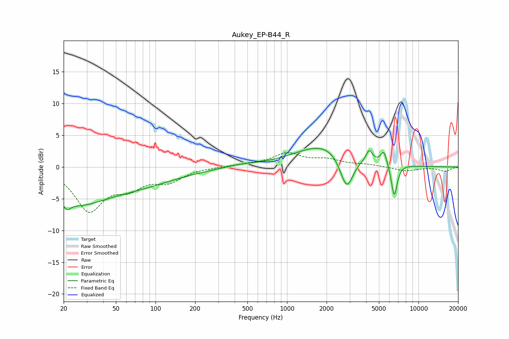

# Aukey_EP-B44_R
See [usage instructions](https://github.com/jaakkopasanen/AutoEq#usage) for more options and info.

### Parametric EQs
Apply preamp of -3.0 dB when using parametric equalizer.

|   # | Type    |   Fc (Hz) |    Q |   Gain (dB) |
|-----|---------|-----------|------|-------------|
|   1 | Peaking |        21 | 5.59 |        -4.6 |
|   2 | Peaking |        21 | 5.83 |         3.3 |
|   3 | Peaking |        25 | 0.66 |        -4.7 |
|   4 | Peaking |        70 | 0.45 |        -2.5 |
|   5 | Peaking |       442 | 1.22 |         0.3 |
|   6 | Peaking |      2008 | 0.63 |         3.7 |
|   7 | Peaking |      2844 | 2.69 |        -5.8 |
|   8 | Peaking |      4220 | 5.94 |         1.8 |
|   9 | Peaking |      5451 | 6    |         2.1 |
|  10 | Peaking |      6537 | 6    |        -5.2 |

### Fixed Band EQs
When using fixed band (also called graphic) equalizer, apply preamp of **-2.4 dB** (if available) and set gains manually with these parameters.

|   # | Type    |   Fc (Hz) |    Q |   Gain (dB) |
|-----|---------|-----------|------|-------------|
|   1 | Peaking |        31 | 1.41 |        -6.6 |
|   2 | Peaking |        62 | 1.41 |        -2.6 |
|   3 | Peaking |       125 | 1.41 |        -2   |
|   4 | Peaking |       250 | 1.41 |        -0   |
|   5 | Peaking |       500 | 1.41 |         0.3 |
|   6 | Peaking |      1000 | 1.41 |         2   |
|   7 | Peaking |      2000 | 1.41 |         1   |
|   8 | Peaking |      4000 | 1.41 |         0.3 |
|   9 | Peaking |      8000 | 1.41 |        -0.6 |
|  10 | Peaking |     16000 | 1.41 |        -0.7 |

### Graphs

