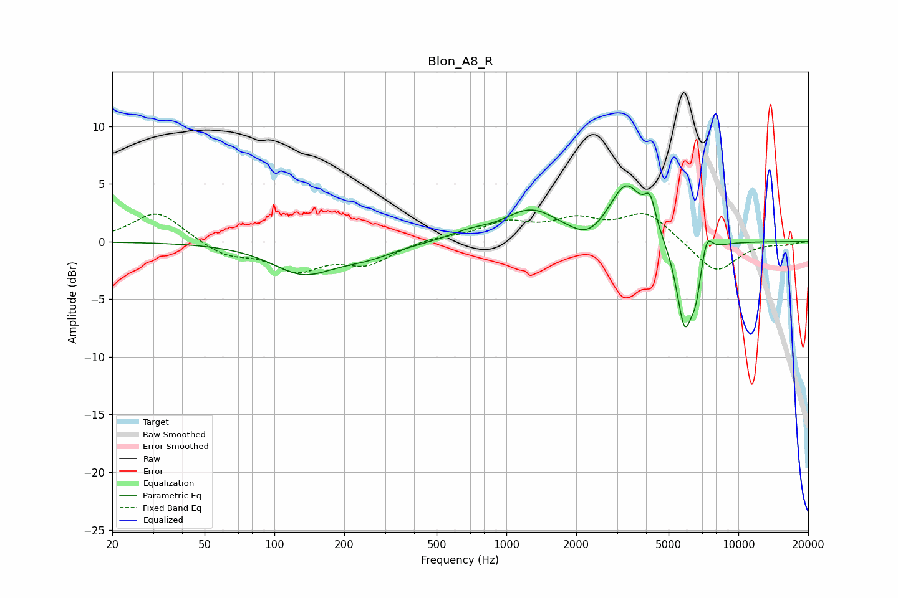

# Blon_A8_R
See [usage instructions](https://github.com/jaakkopasanen/AutoEq#usage) for more options and info.

### Parametric EQs
Apply preamp of -4.9 dB when using parametric equalizer.

|   # | Type    |   Fc (Hz) |    Q |   Gain (dB) |
|-----|---------|-----------|------|-------------|
|   1 | Peaking |       133 | 1.04 |        -2.6 |
|   2 | Peaking |       251 | 1.15 |        -0.9 |
|   3 | Peaking |       687 | 1.69 |         0.5 |
|   4 | Peaking |      1277 | 1.19 |         2.6 |
|   5 | Peaking |      2239 | 2.05 |        -1.1 |
|   6 | Peaking |      3291 | 1.94 |         4.9 |
|   7 | Peaking |      4163 | 6    |         2.4 |
|   8 | Peaking |      5866 | 3.81 |        -7.5 |
|   9 | Peaking |      6558 | 6    |        -2.7 |
|  10 | Peaking |      7308 | 5.99 |         1.9 |

### Fixed Band EQs
When using fixed band (also called graphic) equalizer, apply preamp of **-2.5 dB** (if available) and set gains manually with these parameters.

|   # | Type    |   Fc (Hz) |    Q |   Gain (dB) |
|-----|---------|-----------|------|-------------|
|   1 | Peaking |        31 | 1.41 |         2.7 |
|   2 | Peaking |        62 | 1.41 |        -1.2 |
|   3 | Peaking |       125 | 1.41 |        -2.3 |
|   4 | Peaking |       250 | 1.41 |        -1.8 |
|   5 | Peaking |       500 | 1.41 |         0.4 |
|   6 | Peaking |      1000 | 1.41 |         1.5 |
|   7 | Peaking |      2000 | 1.41 |         1.6 |
|   8 | Peaking |      4000 | 1.41 |         2.5 |
|   9 | Peaking |      8000 | 1.41 |        -2.8 |
|  10 | Peaking |     16000 | 1.41 |        -0.2 |

### Graphs

