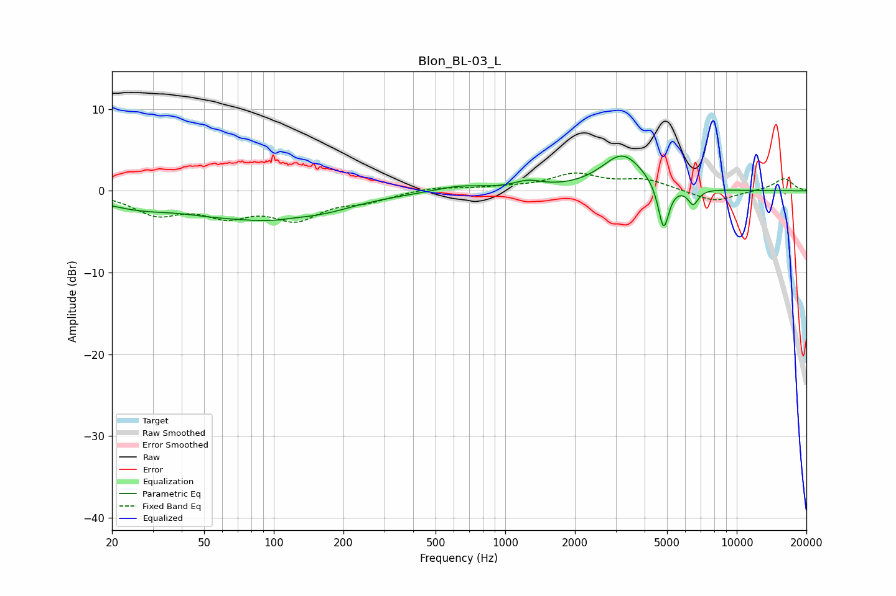

# Blon_BL-03_L
See [usage instructions](https://github.com/jaakkopasanen/AutoEq#usage) for more options and info.

### Parametric EQs
Apply preamp of -4.4 dB when using parametric equalizer.

|   # | Type    |   Fc (Hz) |    Q |   Gain (dB) |
|-----|---------|-----------|------|-------------|
|   1 | Peaking |        26 | 0.85 |        -1.6 |
|   2 | Peaking |        52 | 0.99 |        -0.7 |
|   3 | Peaking |       105 | 0.56 |        -3.2 |
|   4 | Peaking |       120 | 3.33 |         0.1 |
|   5 | Peaking |       183 | 1.75 |        -0.2 |
|   6 | Peaking |       637 | 1.32 |         0.7 |
|   7 | Peaking |      1255 | 2.3  |         0.9 |
|   8 | Peaking |      3218 | 1.56 |         4.4 |
|   9 | Peaking |      4832 | 6    |        -5.8 |
|  10 | Peaking |      6484 | 6    |        -1.9 |

### Fixed Band EQs
When using fixed band (also called graphic) equalizer, apply preamp of **-2.3 dB** (if available) and set gains manually with these parameters.

|   # | Type    |   Fc (Hz) |    Q |   Gain (dB) |
|-----|---------|-----------|------|-------------|
|   1 | Peaking |        31 | 1.41 |        -2.6 |
|   2 | Peaking |        62 | 1.41 |        -2.5 |
|   3 | Peaking |       125 | 1.41 |        -3.1 |
|   4 | Peaking |       250 | 1.41 |        -1   |
|   5 | Peaking |       500 | 1.41 |         0.5 |
|   6 | Peaking |      1000 | 1.41 |         0.3 |
|   7 | Peaking |      2000 | 1.41 |         1.9 |
|   8 | Peaking |      4000 | 1.41 |         1.3 |
|   9 | Peaking |      8000 | 1.41 |        -1.4 |
|  10 | Peaking |     16000 | 1.41 |         1.5 |

### Graphs

