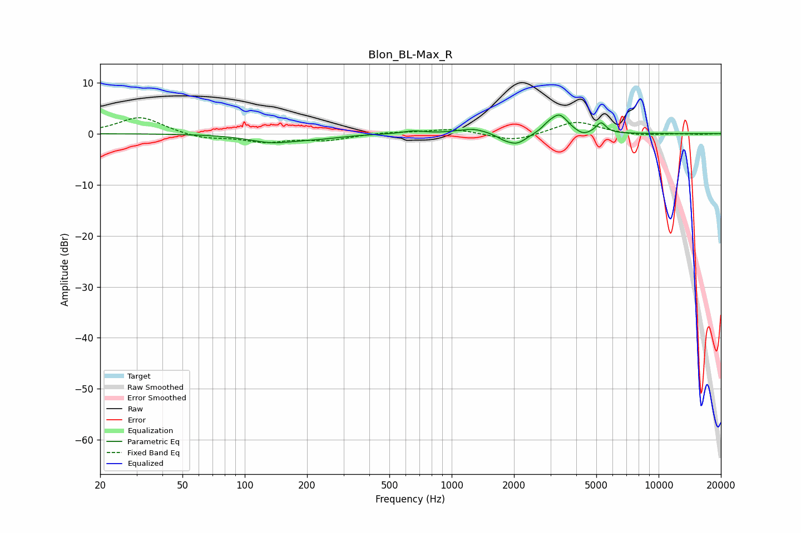

# Blon_BL-Max_R
See [usage instructions](https://github.com/jaakkopasanen/AutoEq#usage) for more options and info.

### Parametric EQs
Apply preamp of -3.7 dB when using parametric equalizer.

|   # | Type    |   Fc (Hz) |    Q |   Gain (dB) |
|-----|---------|-----------|------|-------------|
|   1 | Peaking |       137 | 1.2  |        -1.6 |
|   2 | Peaking |       233 | 1.31 |        -0.6 |
|   3 | Peaking |       654 | 2.82 |         0.6 |
|   4 | Peaking |      1267 | 2.04 |         1   |
|   5 | Peaking |      1778 | 4    |        -0.6 |
|   6 | Peaking |      2062 | 2.86 |        -2.1 |
|   7 | Peaking |      2927 | 4.95 |         0.8 |
|   8 | Peaking |      3317 | 3.35 |         3.6 |
|   9 | Peaking |      4302 | 4.1  |        -0.8 |
|  10 | Peaking |      5267 | 6    |         2.1 |

### Fixed Band EQs
When using fixed band (also called graphic) equalizer, apply preamp of **-3.2 dB** (if available) and set gains manually with these parameters.

|   # | Type    |   Fc (Hz) |    Q |   Gain (dB) |
|-----|---------|-----------|------|-------------|
|   1 | Peaking |        31 | 1.41 |         3.3 |
|   2 | Peaking |        62 | 1.41 |        -1   |
|   3 | Peaking |       125 | 1.41 |        -1.5 |
|   4 | Peaking |       250 | 1.41 |        -1.2 |
|   5 | Peaking |       500 | 1.41 |         0.3 |
|   6 | Peaking |      1000 | 1.41 |         1   |
|   7 | Peaking |      2000 | 1.41 |        -1.6 |
|   8 | Peaking |      4000 | 1.41 |         2.5 |
|   9 | Peaking |      8000 | 1.41 |        -0.4 |
|  10 | Peaking |     16000 | 1.41 |        -0.1 |

### Graphs

