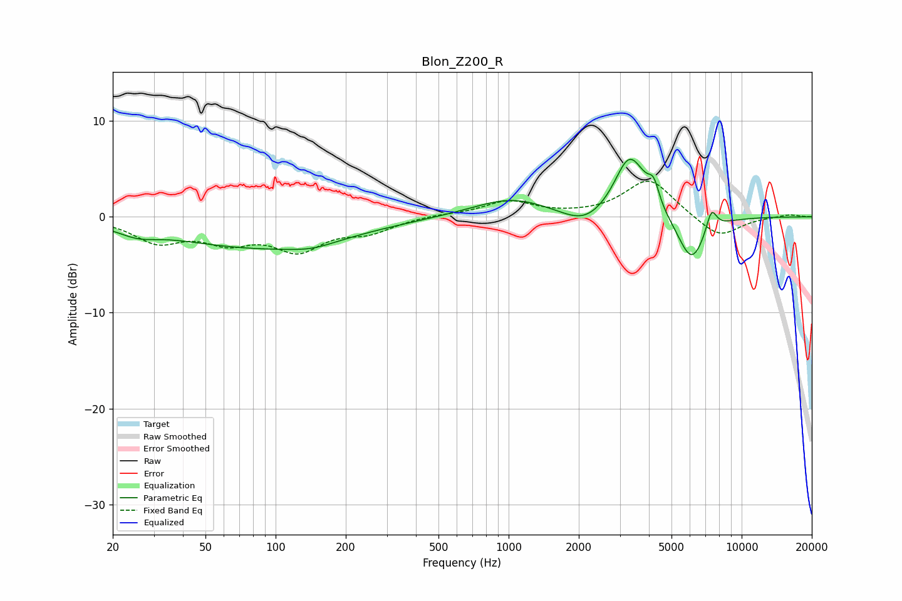

# Blon_Z200_R
See [usage instructions](https://github.com/jaakkopasanen/AutoEq#usage) for more options and info.

### Parametric EQs
Apply preamp of -6.1 dB when using parametric equalizer.

|   # | Type    |   Fc (Hz) |    Q |   Gain (dB) |
|-----|---------|-----------|------|-------------|
|   1 | Peaking |        26 | 1.7  |        -0.9 |
|   2 | Peaking |        86 | 0.37 |        -3.1 |
|   3 | Peaking |       143 | 1.4  |        -0.6 |
|   4 | Peaking |      1029 | 0.84 |         2   |
|   5 | Peaking |      2116 | 1.47 |        -1.6 |
|   6 | Peaking |      3277 | 2.2  |         6   |
|   7 | Peaking |      3721 | 2.72 |         0.8 |
|   8 | Peaking |      4194 | 6    |         2.1 |
|   9 | Peaking |      6100 | 2.27 |        -4.9 |
|  10 | Peaking |      7416 | 5.87 |         2.4 |

### Fixed Band EQs
When using fixed band (also called graphic) equalizer, apply preamp of **-3.8 dB** (if available) and set gains manually with these parameters.

|   # | Type    |   Fc (Hz) |    Q |   Gain (dB) |
|-----|---------|-----------|------|-------------|
|   1 | Peaking |        31 | 1.41 |        -2.4 |
|   2 | Peaking |        62 | 1.41 |        -2.2 |
|   3 | Peaking |       125 | 1.41 |        -3.2 |
|   4 | Peaking |       250 | 1.41 |        -1.4 |
|   5 | Peaking |       500 | 1.41 |         0.2 |
|   6 | Peaking |      1000 | 1.41 |         1.6 |
|   7 | Peaking |      2000 | 1.41 |         0.1 |
|   8 | Peaking |      4000 | 1.41 |         4   |
|   9 | Peaking |      8000 | 1.41 |        -2.3 |
|  10 | Peaking |     16000 | 1.41 |         0.3 |

### Graphs

