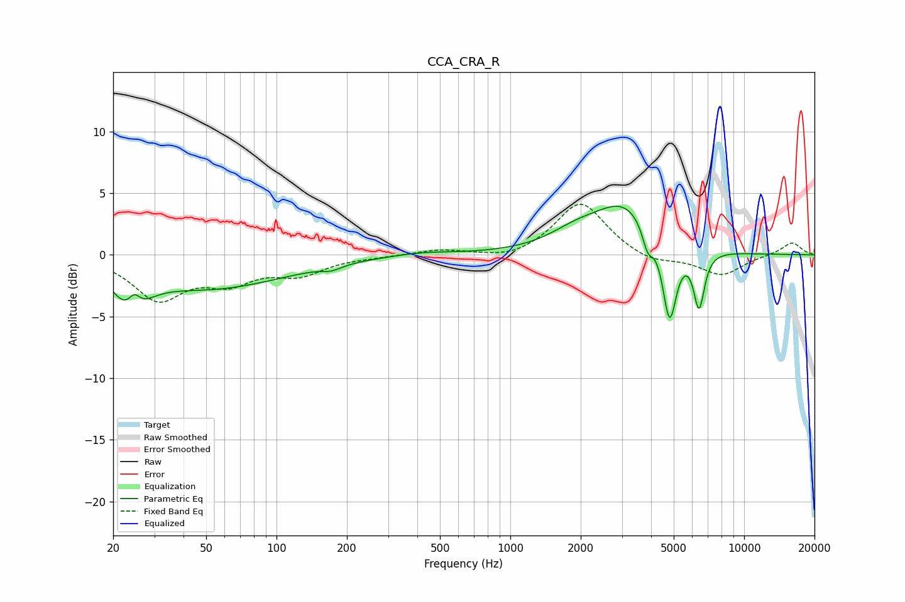

# CCA_CRA_R
See [usage instructions](https://github.com/jaakkopasanen/AutoEq#usage) for more options and info.

### Parametric EQs
Apply preamp of -4.0 dB when using parametric equalizer.

|   # | Type    |   Fc (Hz) |    Q |   Gain (dB) |
|-----|---------|-----------|------|-------------|
|   1 | Peaking |        24 | 2.27 |        -3.4 |
|   2 | Peaking |        25 | 4.93 |         1.9 |
|   3 | Peaking |        52 | 0.43 |        -2.6 |
|   4 | Peaking |       172 | 3.42 |        -0.4 |
|   5 | Peaking |       418 | 1.1  |         0.3 |
|   6 | Peaking |      1904 | 1.23 |         1.2 |
|   7 | Peaking |      3102 | 1.07 |         3.9 |
|   8 | Peaking |      3868 | 6    |        -1.9 |
|   9 | Peaking |      4798 | 4.69 |        -6.6 |
|  10 | Peaking |      6416 | 5.91 |        -4.6 |

### Fixed Band EQs
When using fixed band (also called graphic) equalizer, apply preamp of **-4.2 dB** (if available) and set gains manually with these parameters.

|   # | Type    |   Fc (Hz) |    Q |   Gain (dB) |
|-----|---------|-----------|------|-------------|
|   1 | Peaking |        31 | 1.41 |        -3.4 |
|   2 | Peaking |        62 | 1.41 |        -1.9 |
|   3 | Peaking |       125 | 1.41 |        -1.4 |
|   4 | Peaking |       250 | 1.41 |        -0.1 |
|   5 | Peaking |       500 | 1.41 |         0.4 |
|   6 | Peaking |      1000 | 1.41 |        -0.5 |
|   7 | Peaking |      2000 | 1.41 |         4.3 |
|   8 | Peaking |      4000 | 1.41 |        -0.7 |
|   9 | Peaking |      8000 | 1.41 |        -1.7 |
|  10 | Peaking |     16000 | 1.41 |         1   |

### Graphs

