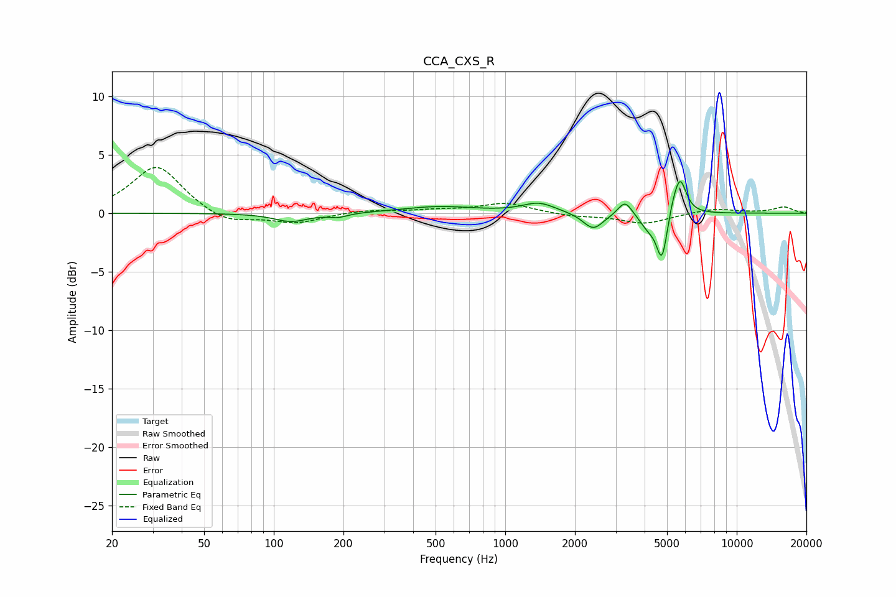

# CCA_CXS_R
See [usage instructions](https://github.com/jaakkopasanen/AutoEq#usage) for more options and info.

### Parametric EQs
Apply preamp of -2.8 dB when using parametric equalizer.

|   # | Type    |   Fc (Hz) |    Q |   Gain (dB) |
|-----|---------|-----------|------|-------------|
|   1 | Peaking |       119 | 1.96 |        -0.7 |
|   2 | Peaking |       190 | 3.49 |        -0.3 |
|   3 | Peaking |       517 | 0.9  |         0.6 |
|   4 | Peaking |      1397 | 2    |         0.8 |
|   5 | Peaking |      2400 | 3.19 |        -1.4 |
|   6 | Peaking |      3292 | 4.73 |         1.3 |
|   7 | Peaking |      4144 | 3.91 |        -1.1 |
|   8 | Peaking |      4754 | 5.93 |        -4   |
|   9 | Peaking |      5312 | 6    |         0.9 |
|  10 | Peaking |      5701 | 5.26 |         3   |

### Fixed Band EQs
When using fixed band (also called graphic) equalizer, apply preamp of **-4.0 dB** (if available) and set gains manually with these parameters.

|   # | Type    |   Fc (Hz) |    Q |   Gain (dB) |
|-----|---------|-----------|------|-------------|
|   1 | Peaking |        31 | 1.41 |         4.1 |
|   2 | Peaking |        62 | 1.41 |        -1   |
|   3 | Peaking |       125 | 1.41 |        -0.8 |
|   4 | Peaking |       250 | 1.41 |         0.3 |
|   5 | Peaking |       500 | 1.41 |         0.2 |
|   6 | Peaking |      1000 | 1.41 |         0.9 |
|   7 | Peaking |      2000 | 1.41 |        -0.3 |
|   8 | Peaking |      4000 | 1.41 |        -0.9 |
|   9 | Peaking |      8000 | 1.41 |         0.4 |
|  10 | Peaking |     16000 | 1.41 |         0.5 |

### Graphs

