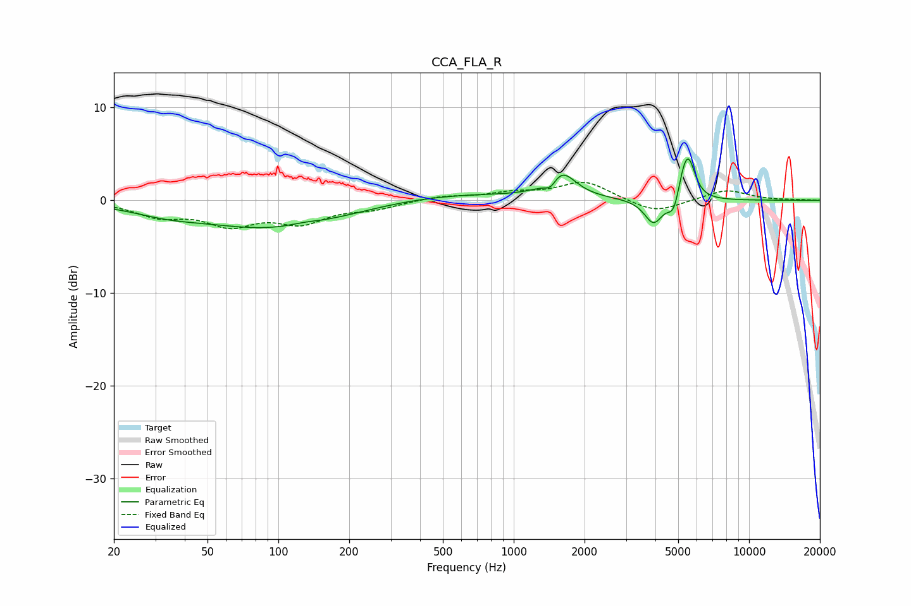

# CCA_FLA_R
See [usage instructions](https://github.com/jaakkopasanen/AutoEq#usage) for more options and info.

### Parametric EQs
Apply preamp of -4.6 dB when using parametric equalizer.

|   # | Type    |   Fc (Hz) |    Q |   Gain (dB) |
|-----|---------|-----------|------|-------------|
|   1 | Peaking |        33 | 0.95 |        -0.8 |
|   2 | Peaking |        97 | 0.45 |        -3   |
|   3 | Peaking |       128 | 2.12 |         0.3 |
|   4 | Peaking |       521 | 0.45 |         0.8 |
|   5 | Peaking |      1437 | 5.13 |        -1.2 |
|   6 | Peaking |      1583 | 2.38 |         3   |
|   7 | Peaking |      3929 | 3.62 |        -2.7 |
|   8 | Peaking |      4780 | 6    |        -1.9 |
|   9 | Peaking |      5264 | 5.96 |         1.8 |
|  10 | Peaking |      5553 | 4.88 |         3.9 |

### Fixed Band EQs
When using fixed band (also called graphic) equalizer, apply preamp of **-2.0 dB** (if available) and set gains manually with these parameters.

|   # | Type    |   Fc (Hz) |    Q |   Gain (dB) |
|-----|---------|-----------|------|-------------|
|   1 | Peaking |        31 | 1.41 |        -1.5 |
|   2 | Peaking |        62 | 1.41 |        -2.4 |
|   3 | Peaking |       125 | 1.41 |        -2.2 |
|   4 | Peaking |       250 | 1.41 |        -0.8 |
|   5 | Peaking |       500 | 1.41 |         0.5 |
|   6 | Peaking |      1000 | 1.41 |         0.7 |
|   7 | Peaking |      2000 | 1.41 |         2   |
|   8 | Peaking |      4000 | 1.41 |        -1.4 |
|   9 | Peaking |      8000 | 1.41 |         1.2 |
|  10 | Peaking |     16000 | 1.41 |         0.1 |

### Graphs

