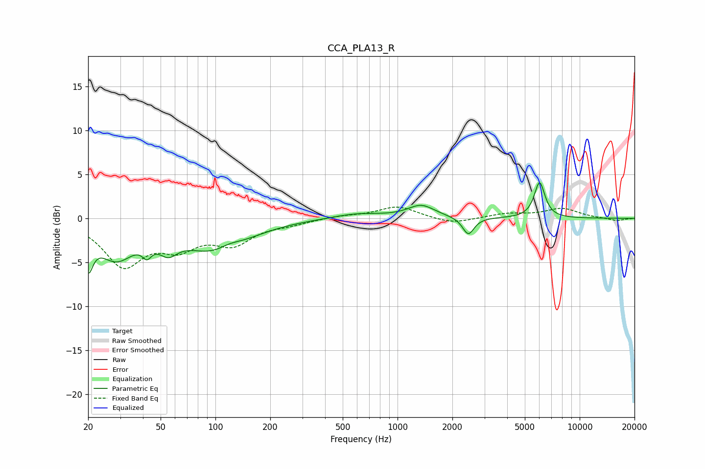

# CCA_PLA13_R
See [usage instructions](https://github.com/jaakkopasanen/AutoEq#usage) for more options and info.

### Parametric EQs
Apply preamp of -4.1 dB when using parametric equalizer.

|   # | Type    |   Fc (Hz) |    Q |   Gain (dB) |
|-----|---------|-----------|------|-------------|
|   1 | Peaking |        20 | 5.49 |        -3.9 |
|   2 | Peaking |        28 | 1.41 |        -4.1 |
|   3 | Peaking |        42 | 5.74 |        -1.3 |
|   4 | Peaking |        55 | 2.81 |        -1.8 |
|   5 | Peaking |       102 | 0.81 |        -3.8 |
|   6 | Peaking |       119 | 2.05 |         0.8 |
|   7 | Peaking |       600 | 1.05 |         0.6 |
|   8 | Peaking |      1349 | 1.92 |         1.4 |
|   9 | Peaking |      2447 | 4.55 |        -2   |
|  10 | Peaking |      6024 | 4.75 |         4   |

### Fixed Band EQs
When using fixed band (also called graphic) equalizer, apply preamp of **-1.4 dB** (if available) and set gains manually with these parameters.

|   # | Type    |   Fc (Hz) |    Q |   Gain (dB) |
|-----|---------|-----------|------|-------------|
|   1 | Peaking |        31 | 1.41 |        -5.1 |
|   2 | Peaking |        62 | 1.41 |        -2.7 |
|   3 | Peaking |       125 | 1.41 |        -2.6 |
|   4 | Peaking |       250 | 1.41 |        -0.5 |
|   5 | Peaking |       500 | 1.41 |         0.3 |
|   6 | Peaking |      1000 | 1.41 |         1.4 |
|   7 | Peaking |      2000 | 1.41 |        -0.7 |
|   8 | Peaking |      4000 | 1.41 |         0.5 |
|   9 | Peaking |      8000 | 1.41 |         1.1 |
|  10 | Peaking |     16000 | 1.41 |        -0.3 |

### Graphs

