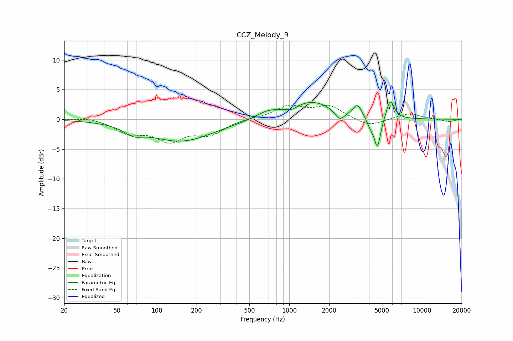

# CCZ_Melody_R
See [usage instructions](https://github.com/jaakkopasanen/AutoEq#usage) for more options and info.

### Parametric EQs
Apply preamp of -3.0 dB when using parametric equalizer.

|   # | Type    |   Fc (Hz) |    Q |   Gain (dB) |
|-----|---------|-----------|------|-------------|
|   1 | Peaking |        67 | 2.06 |        -1.2 |
|   2 | Peaking |       153 | 0.58 |        -3.6 |
|   3 | Peaking |       680 | 1.71 |         0.9 |
|   4 | Peaking |      1048 | 3.29 |        -0.7 |
|   5 | Peaking |      1470 | 0.78 |         3.1 |
|   6 | Peaking |      2400 | 3.71 |        -1.8 |
|   7 | Peaking |      3275 | 4.55 |         1.9 |
|   8 | Peaking |      4089 | 5.26 |        -1.2 |
|   9 | Peaking |      4624 | 5.54 |        -5.1 |
|  10 | Peaking |      5783 | 4.7  |         3.3 |

### Fixed Band EQs
When using fixed band (also called graphic) equalizer, apply preamp of **-2.5 dB** (if available) and set gains manually with these parameters.

|   # | Type    |   Fc (Hz) |    Q |   Gain (dB) |
|-----|---------|-----------|------|-------------|
|   1 | Peaking |        31 | 1.41 |         0.4 |
|   2 | Peaking |        62 | 1.41 |        -2.1 |
|   3 | Peaking |       125 | 1.41 |        -3.3 |
|   4 | Peaking |       250 | 1.41 |        -2.3 |
|   5 | Peaking |       500 | 1.41 |         0.2 |
|   6 | Peaking |      1000 | 1.41 |         2.1 |
|   7 | Peaking |      2000 | 1.41 |         2.1 |
|   8 | Peaking |      4000 | 1.41 |        -1.3 |
|   9 | Peaking |      8000 | 1.41 |         1   |
|  10 | Peaking |     16000 | 1.41 |        -0.4 |

### Graphs

