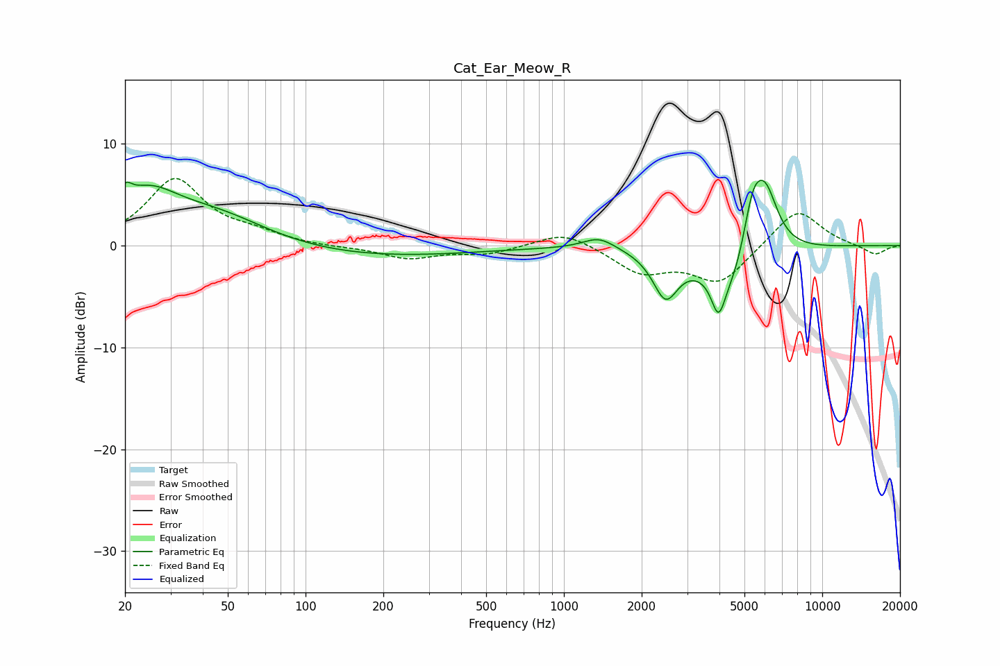

# Cat_Ear_Meow_R
See [usage instructions](https://github.com/jaakkopasanen/AutoEq#usage) for more options and info.

### Parametric EQs
Apply preamp of -6.5 dB when using parametric equalizer.

|   # | Type    |   Fc (Hz) |    Q |   Gain (dB) |
|-----|---------|-----------|------|-------------|
|   1 | Peaking |        20 | 5.63 |         1.7 |
|   2 | Peaking |        24 | 1.19 |         4.1 |
|   3 | Peaking |        45 | 0.66 |         3.2 |
|   4 | Peaking |       144 | 0.31 |        -1.3 |
|   5 | Peaking |      1368 | 2.25 |         1.2 |
|   6 | Peaking |      2474 | 2.91 |        -4.4 |
|   7 | Peaking |      3965 | 5.34 |        -3.6 |
|   8 | Peaking |      4642 | 1.39 |        -5.6 |
|   9 | Peaking |      5364 | 3.38 |         5.7 |
|  10 | Peaking |      6020 | 2.6  |         6.6 |

### Fixed Band EQs
When using fixed band (also called graphic) equalizer, apply preamp of **-6.7 dB** (if available) and set gains manually with these parameters.

|   # | Type    |   Fc (Hz) |    Q |   Gain (dB) |
|-----|---------|-----------|------|-------------|
|   1 | Peaking |        31 | 1.41 |         6.4 |
|   2 | Peaking |        62 | 1.41 |         0.9 |
|   3 | Peaking |       125 | 1.41 |        -0.2 |
|   4 | Peaking |       250 | 1.41 |        -1.2 |
|   5 | Peaking |       500 | 1.41 |        -0.8 |
|   6 | Peaking |      1000 | 1.41 |         1.5 |
|   7 | Peaking |      2000 | 1.41 |        -2.5 |
|   8 | Peaking |      4000 | 1.41 |        -3.6 |
|   9 | Peaking |      8000 | 1.41 |         3.7 |
|  10 | Peaking |     16000 | 1.41 |        -1   |

### Graphs

