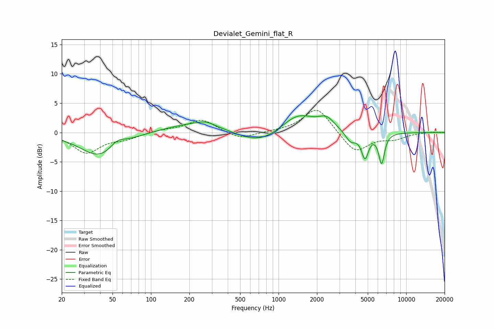

# Devialet_Gemini_flat_R
See [usage instructions](https://github.com/jaakkopasanen/AutoEq#usage) for more options and info.

### Parametric EQs
Apply preamp of -3.0 dB when using parametric equalizer.

|   # | Type    |   Fc (Hz) |    Q |   Gain (dB) |
|-----|---------|-----------|------|-------------|
|   1 | Peaking |        40 | 0.93 |        -4.2 |
|   2 | Peaking |        54 | 2.34 |         1.5 |
|   3 | Peaking |       229 | 0.6  |         1.7 |
|   4 | Peaking |       269 | 2.27 |         0.6 |
|   5 | Peaking |       710 | 0.82 |        -2.3 |
|   6 | Peaking |      1419 | 1.07 |         3.4 |
|   7 | Peaking |      2379 | 2.28 |         1.8 |
|   8 | Peaking |      3671 | 3.38 |        -1.8 |
|   9 | Peaking |      4755 | 4.98 |        -4.2 |
|  10 | Peaking |      6417 | 6    |        -5.1 |

### Fixed Band EQs
When using fixed band (also called graphic) equalizer, apply preamp of **-3.9 dB** (if available) and set gains manually with these parameters.

|   # | Type    |   Fc (Hz) |    Q |   Gain (dB) |
|-----|---------|-----------|------|-------------|
|   1 | Peaking |        31 | 1.41 |        -3.4 |
|   2 | Peaking |        62 | 1.41 |        -0.9 |
|   3 | Peaking |       125 | 1.41 |         0.4 |
|   4 | Peaking |       250 | 1.41 |         2.2 |
|   5 | Peaking |       500 | 1.41 |        -1.2 |
|   6 | Peaking |      1000 | 1.41 |         0.1 |
|   7 | Peaking |      2000 | 1.41 |         4.4 |
|   8 | Peaking |      4000 | 1.41 |        -3.5 |
|   9 | Peaking |      8000 | 1.41 |        -1   |
|  10 | Peaking |     16000 | 1.41 |         0.1 |

### Graphs

