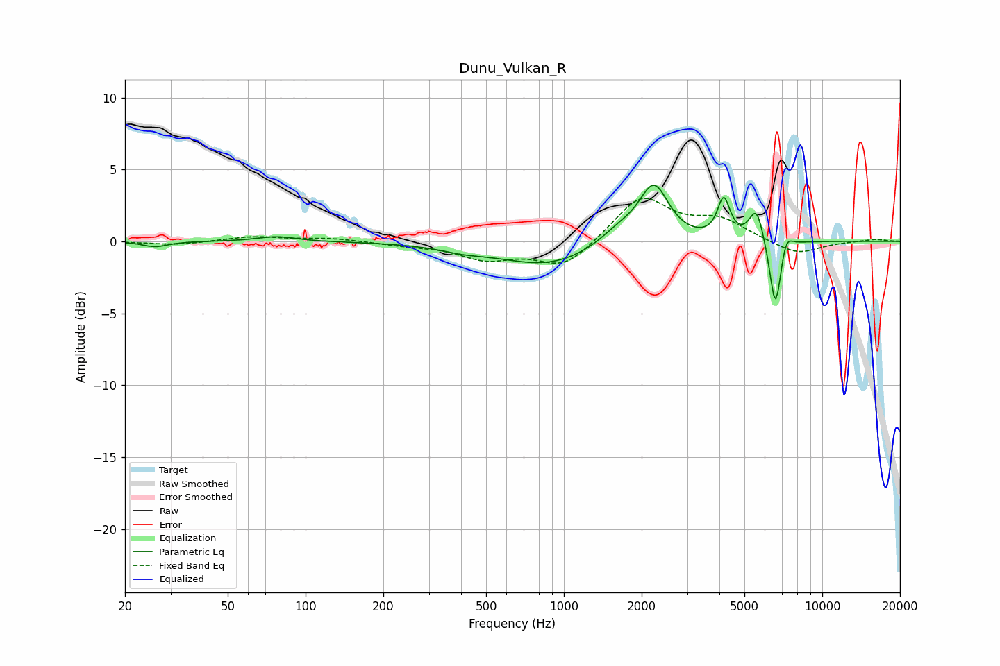

# Dunu_Vulkan_R
See [usage instructions](https://github.com/jaakkopasanen/AutoEq#usage) for more options and info.

### Parametric EQs
Apply preamp of -4.0 dB when using parametric equalizer.

|   # | Type    |   Fc (Hz) |    Q |   Gain (dB) |
|-----|---------|-----------|------|-------------|
|   1 | Peaking |        26 | 3    |        -0.4 |
|   2 | Peaking |        77 | 1.9  |         0.4 |
|   3 | Peaking |       406 | 1.69 |        -0.3 |
|   4 | Peaking |       873 | 0.73 |        -1.7 |
|   5 | Peaking |      1639 | 1.7  |         1.1 |
|   6 | Peaking |      2232 | 2.5  |         3.8 |
|   7 | Peaking |      4158 | 5.88 |         2.7 |
|   8 | Peaking |      5567 | 5    |         2.4 |
|   9 | Peaking |      6595 | 6    |        -5.1 |
|  10 | Peaking |      7230 | 6    |         1.2 |

### Fixed Band EQs
When using fixed band (also called graphic) equalizer, apply preamp of **-3.1 dB** (if available) and set gains manually with these parameters.

|   # | Type    |   Fc (Hz) |    Q |   Gain (dB) |
|-----|---------|-----------|------|-------------|
|   1 | Peaking |        31 | 1.41 |        -0.2 |
|   2 | Peaking |        62 | 1.41 |         0.3 |
|   3 | Peaking |       125 | 1.41 |         0.2 |
|   4 | Peaking |       250 | 1.41 |        -0.2 |
|   5 | Peaking |       500 | 1.41 |        -1.1 |
|   6 | Peaking |      1000 | 1.41 |        -1.8 |
|   7 | Peaking |      2000 | 1.41 |         3.1 |
|   8 | Peaking |      4000 | 1.41 |         1.4 |
|   9 | Peaking |      8000 | 1.41 |        -1   |
|  10 | Peaking |     16000 | 1.41 |         0.2 |

### Graphs

