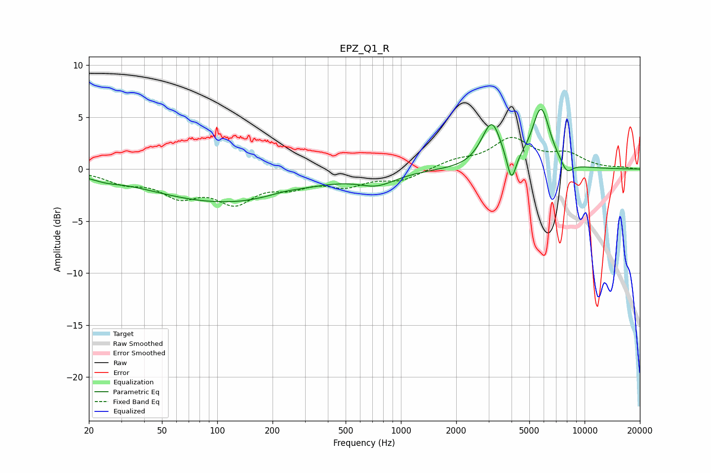

# EPZ_Q1_R
See [usage instructions](https://github.com/jaakkopasanen/AutoEq#usage) for more options and info.

### Parametric EQs
Apply preamp of -5.8 dB when using parametric equalizer.

|   # | Type    |   Fc (Hz) |    Q |   Gain (dB) |
|-----|---------|-----------|------|-------------|
|   1 | Peaking |        25 | 1.97 |        -0.3 |
|   2 | Peaking |       109 | 0.35 |        -3.1 |
|   3 | Peaking |       134 | 3.86 |        -0   |
|   4 | Peaking |       233 | 1.65 |         0.3 |
|   5 | Peaking |       741 | 1.38 |        -1.2 |
|   6 | Peaking |      2807 | 2.56 |         0.5 |
|   7 | Peaking |      3138 | 2.88 |         3.9 |
|   8 | Peaking |      3999 | 5.76 |        -2.8 |
|   9 | Peaking |      5793 | 2.83 |         5.7 |
|  10 | Peaking |      7997 | 4.15 |        -1.2 |

### Fixed Band EQs
When using fixed band (also called graphic) equalizer, apply preamp of **-3.1 dB** (if available) and set gains manually with these parameters.

|   # | Type    |   Fc (Hz) |    Q |   Gain (dB) |
|-----|---------|-----------|------|-------------|
|   1 | Peaking |        31 | 1.41 |        -1.1 |
|   2 | Peaking |        62 | 1.41 |        -2.2 |
|   3 | Peaking |       125 | 1.41 |        -2.8 |
|   4 | Peaking |       250 | 1.41 |        -1.3 |
|   5 | Peaking |       500 | 1.41 |        -1.4 |
|   6 | Peaking |      1000 | 1.41 |        -1   |
|   7 | Peaking |      2000 | 1.41 |         0.7 |
|   8 | Peaking |      4000 | 1.41 |         2.8 |
|   9 | Peaking |      8000 | 1.41 |         1.3 |
|  10 | Peaking |     16000 | 1.41 |         0.1 |

### Graphs

