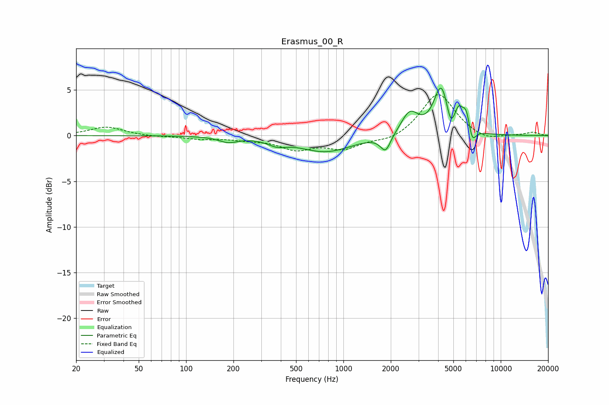

# Erasmus_00_R
See [usage instructions](https://github.com/jaakkopasanen/AutoEq#usage) for more options and info.

### Parametric EQs
Apply preamp of -5.3 dB when using parametric equalizer.

|   # | Type    |   Fc (Hz) |    Q |   Gain (dB) |
|-----|---------|-----------|------|-------------|
|   1 | Peaking |       185 | 2.41 |        -0.6 |
|   2 | Peaking |       379 | 2.39 |        -0.6 |
|   3 | Peaking |       771 | 0.86 |        -1.7 |
|   4 | Peaking |      1854 | 4.37 |        -1.8 |
|   5 | Peaking |      2640 | 2.58 |         2.5 |
|   6 | Peaking |      4185 | 3.04 |         5.2 |
|   7 | Peaking |      4796 | 5.99 |        -1.7 |
|   8 | Peaking |      5404 | 5.99 |         1.7 |
|   9 | Peaking |      6023 | 5.43 |         2.3 |
|  10 | Peaking |      6578 | 6    |        -1.7 |

### Fixed Band EQs
When using fixed band (also called graphic) equalizer, apply preamp of **-4.6 dB** (if available) and set gains manually with these parameters.

|   # | Type    |   Fc (Hz) |    Q |   Gain (dB) |
|-----|---------|-----------|------|-------------|
|   1 | Peaking |        31 | 1.41 |         1   |
|   2 | Peaking |        62 | 1.41 |        -0.1 |
|   3 | Peaking |       125 | 1.41 |        -0.3 |
|   4 | Peaking |       250 | 1.41 |        -0.3 |
|   5 | Peaking |       500 | 1.41 |        -1.4 |
|   6 | Peaking |      1000 | 1.41 |        -1.3 |
|   7 | Peaking |      2000 | 1.41 |        -0.7 |
|   8 | Peaking |      4000 | 1.41 |         4.7 |
|   9 | Peaking |      8000 | 1.41 |        -0.7 |
|  10 | Peaking |     16000 | 1.41 |         0.4 |

### Graphs

