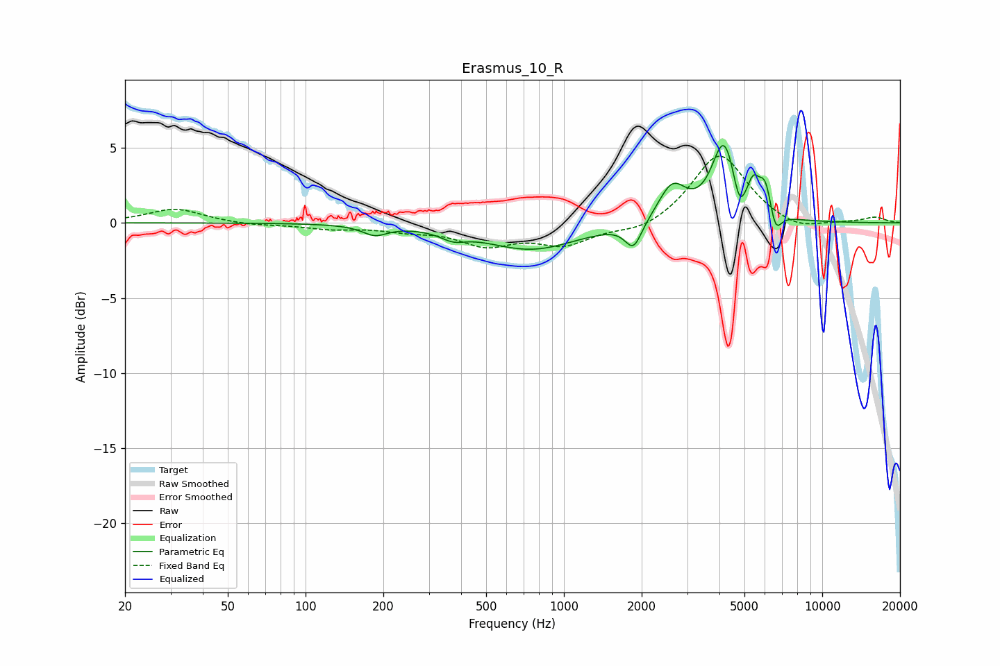

# Erasmus_10_R
See [usage instructions](https://github.com/jaakkopasanen/AutoEq#usage) for more options and info.

### Parametric EQs
Apply preamp of -5.3 dB when using parametric equalizer.

|   # | Type    |   Fc (Hz) |    Q |   Gain (dB) |
|-----|---------|-----------|------|-------------|
|   1 | Peaking |       186 | 2.98 |        -0.6 |
|   2 | Peaking |       372 | 2.93 |        -0.5 |
|   3 | Peaking |       748 | 0.79 |        -1.8 |
|   4 | Peaking |      1860 | 4.35 |        -1.7 |
|   5 | Peaking |      2627 | 2.61 |         2.4 |
|   6 | Peaking |      4168 | 2.99 |         5.2 |
|   7 | Peaking |      4780 | 5.98 |        -1.8 |
|   8 | Peaking |      5412 | 5.99 |         1.7 |
|   9 | Peaking |      6027 | 5.45 |         2.2 |
|  10 | Peaking |      6584 | 6    |        -1.6 |

### Fixed Band EQs
When using fixed band (also called graphic) equalizer, apply preamp of **-4.5 dB** (if available) and set gains manually with these parameters.

|   # | Type    |   Fc (Hz) |    Q |   Gain (dB) |
|-----|---------|-----------|------|-------------|
|   1 | Peaking |        31 | 1.41 |         0.9 |
|   2 | Peaking |        62 | 1.41 |        -0.2 |
|   3 | Peaking |       125 | 1.41 |        -0.3 |
|   4 | Peaking |       250 | 1.41 |        -0.4 |
|   5 | Peaking |       500 | 1.41 |        -1.3 |
|   6 | Peaking |      1000 | 1.41 |        -1.3 |
|   7 | Peaking |      2000 | 1.41 |        -0.7 |
|   8 | Peaking |      4000 | 1.41 |         4.7 |
|   9 | Peaking |      8000 | 1.41 |        -0.6 |
|  10 | Peaking |     16000 | 1.41 |         0.4 |

### Graphs

