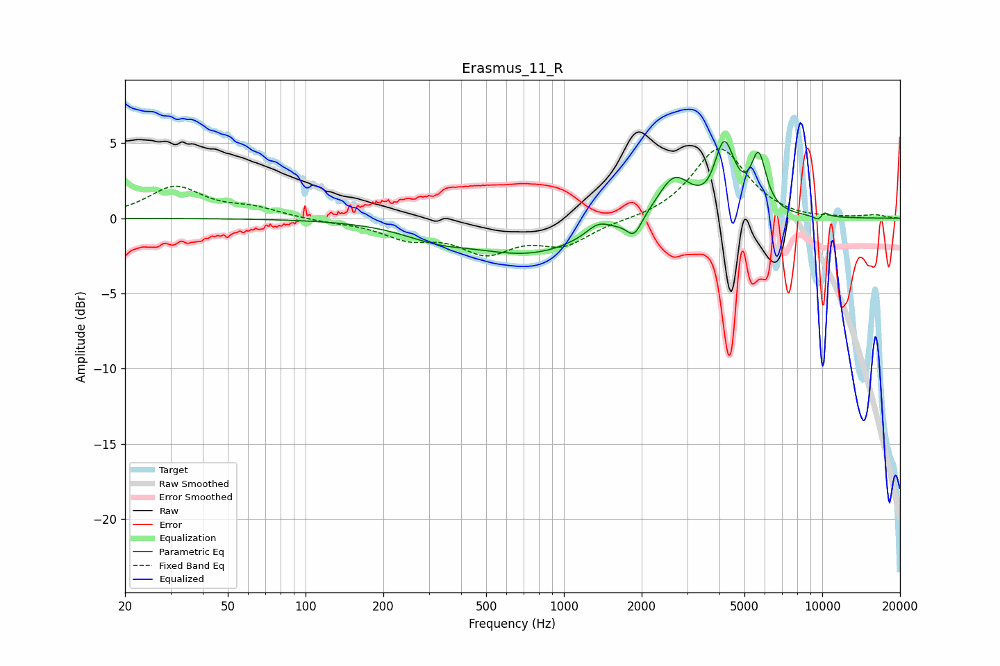

# Erasmus_11_R
See [usage instructions](https://github.com/jaakkopasanen/AutoEq#usage) for more options and info.

### Parametric EQs
Apply preamp of -5.2 dB when using parametric equalizer.

|   # | Type    |   Fc (Hz) |    Q |   Gain (dB) |
|-----|---------|-----------|------|-------------|
|   1 | Peaking |       319 | 1.09 |        -0.8 |
|   2 | Peaking |       738 | 0.62 |        -2.3 |
|   3 | Peaking |      1354 | 3.08 |         0.8 |
|   4 | Peaking |      1871 | 4.9  |        -1.2 |
|   5 | Peaking |      2669 | 2.17 |         2.8 |
|   6 | Peaking |      3748 | 3.16 |        -0.7 |
|   7 | Peaking |      4159 | 3.36 |         4.9 |
|   8 | Peaking |      5675 | 4.82 |         3.6 |
|   9 | Peaking |      9859 | 5.97 |        -1.4 |
|  10 | Peaking |     10000 | 6    |         1.4 |

### Fixed Band EQs
When using fixed band (also called graphic) equalizer, apply preamp of **-4.7 dB** (if available) and set gains manually with these parameters.

|   # | Type    |   Fc (Hz) |    Q |   Gain (dB) |
|-----|---------|-----------|------|-------------|
|   1 | Peaking |        31 | 1.41 |         2   |
|   2 | Peaking |        62 | 1.41 |         0.6 |
|   3 | Peaking |       125 | 1.41 |        -0.2 |
|   4 | Peaking |       250 | 1.41 |        -1.2 |
|   5 | Peaking |       500 | 1.41 |        -2   |
|   6 | Peaking |      1000 | 1.41 |        -1.6 |
|   7 | Peaking |      2000 | 1.41 |        -0.1 |
|   8 | Peaking |      4000 | 1.41 |         4.7 |
|   9 | Peaking |      8000 | 1.41 |        -0.2 |
|  10 | Peaking |     16000 | 1.41 |         0.2 |

### Graphs

