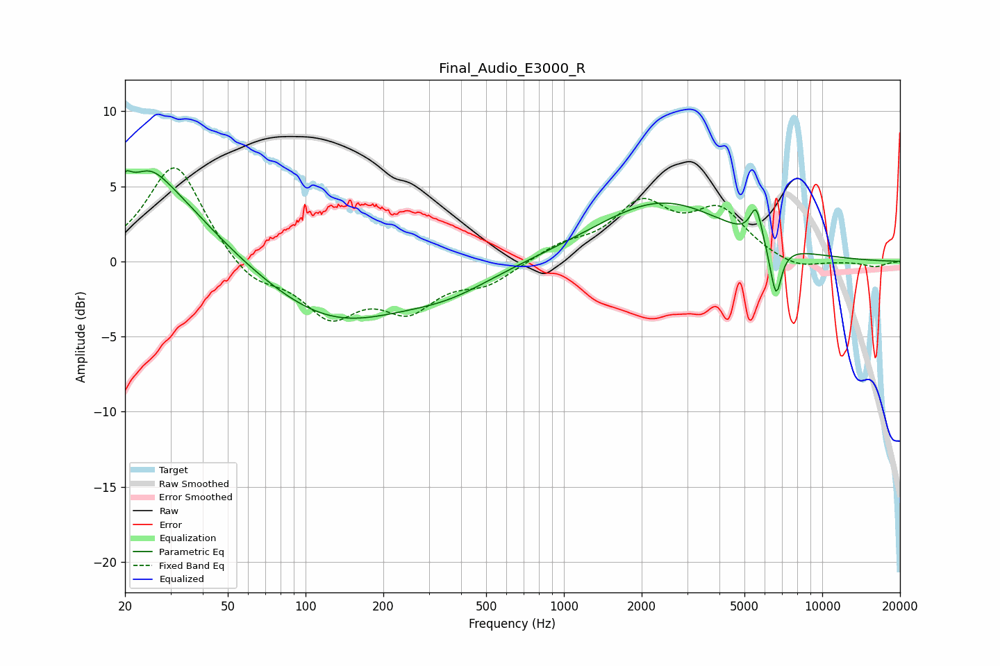

# Final_Audio_E3000_R
See [usage instructions](https://github.com/jaakkopasanen/AutoEq#usage) for more options and info.

### Parametric EQs
Apply preamp of -6.1 dB when using parametric equalizer.

|   # | Type    |   Fc (Hz) |    Q |   Gain (dB) |
|-----|---------|-----------|------|-------------|
|   1 | Peaking |        20 | 5.97 |         3.2 |
|   2 | Peaking |        20 | 5.99 |        -2.1 |
|   3 | Peaking |        25 | 2.23 |         1.1 |
|   4 | Peaking |        26 | 0.68 |         5.3 |
|   5 | Peaking |       129 | 0.51 |        -3.9 |
|   6 | Peaking |       360 | 0.79 |        -1.3 |
|   7 | Peaking |      2390 | 0.55 |         4   |
|   8 | Peaking |      5550 | 5.96 |         2.3 |
|   9 | Peaking |      6661 | 5.57 |        -4.4 |
|  10 | Peaking |      6858 | 6    |         1   |

### Fixed Band EQs
When using fixed band (also called graphic) equalizer, apply preamp of **-6.3 dB** (if available) and set gains manually with these parameters.

|   # | Type    |   Fc (Hz) |    Q |   Gain (dB) |
|-----|---------|-----------|------|-------------|
|   1 | Peaking |        31 | 1.41 |         6.6 |
|   2 | Peaking |        62 | 1.41 |        -1.6 |
|   3 | Peaking |       125 | 1.41 |        -3.4 |
|   4 | Peaking |       250 | 1.41 |        -2.8 |
|   5 | Peaking |       500 | 1.41 |        -1.3 |
|   6 | Peaking |      1000 | 1.41 |         1   |
|   7 | Peaking |      2000 | 1.41 |         3.6 |
|   8 | Peaking |      4000 | 1.41 |         3.1 |
|   9 | Peaking |      8000 | 1.41 |        -0.6 |
|  10 | Peaking |     16000 | 1.41 |        -0.4 |

### Graphs

