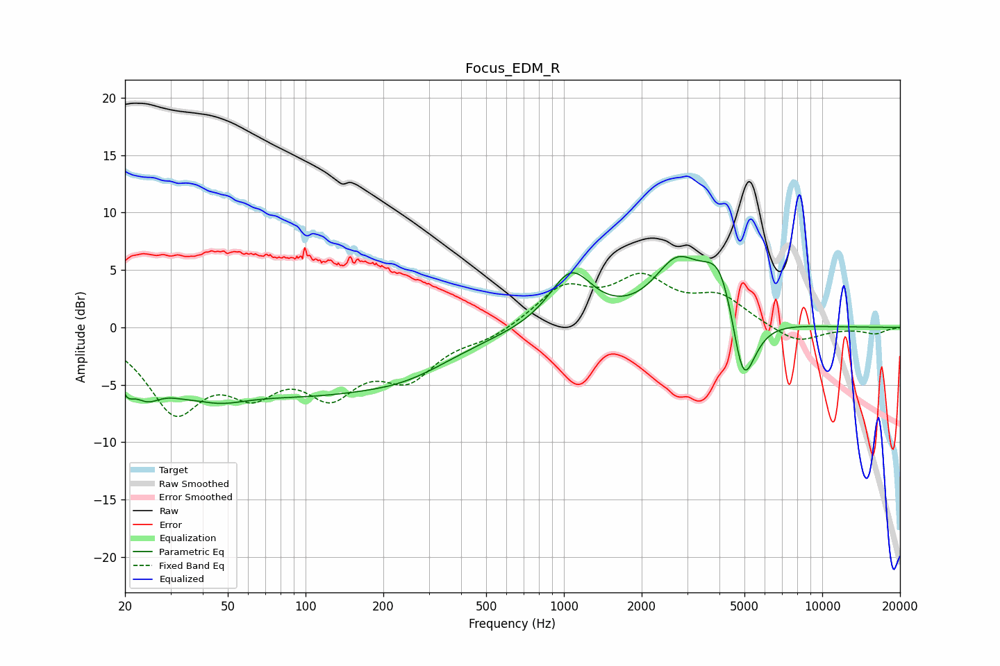

# Focus_EDM_R
See [usage instructions](https://github.com/jaakkopasanen/AutoEq#usage) for more options and info.

### Parametric EQs
Apply preamp of -6.3 dB when using parametric equalizer.

|   # | Type    |   Fc (Hz) |    Q |   Gain (dB) |
|-----|---------|-----------|------|-------------|
|   1 | Peaking |        20 | 4.91 |        -2.1 |
|   2 | Peaking |        24 | 2.55 |        -2.4 |
|   3 | Peaking |        38 | 1.1  |        -6.5 |
|   4 | Peaking |        39 | 1.57 |         3.2 |
|   5 | Peaking |       106 | 0.39 |        -4.9 |
|   6 | Peaking |       252 | 0.8  |        -1.5 |
|   7 | Peaking |      1065 | 1.69 |         4.7 |
|   8 | Peaking |      2727 | 1.58 |         4.8 |
|   9 | Peaking |      4075 | 1.9  |         6.2 |
|  10 | Peaking |      4930 | 2.77 |        -8.3 |

### Fixed Band EQs
When using fixed band (also called graphic) equalizer, apply preamp of **-4.8 dB** (if available) and set gains manually with these parameters.

|   # | Type    |   Fc (Hz) |    Q |   Gain (dB) |
|-----|---------|-----------|------|-------------|
|   1 | Peaking |        31 | 1.41 |        -6.7 |
|   2 | Peaking |        62 | 1.41 |        -4.3 |
|   3 | Peaking |       125 | 1.41 |        -4.8 |
|   4 | Peaking |       250 | 1.41 |        -3.8 |
|   5 | Peaking |       500 | 1.41 |        -0.9 |
|   6 | Peaking |      1000 | 1.41 |         3.3 |
|   7 | Peaking |      2000 | 1.41 |         3.8 |
|   8 | Peaking |      4000 | 1.41 |         2.4 |
|   9 | Peaking |      8000 | 1.41 |        -1.4 |
|  10 | Peaking |     16000 | 1.41 |        -0.5 |

### Graphs

