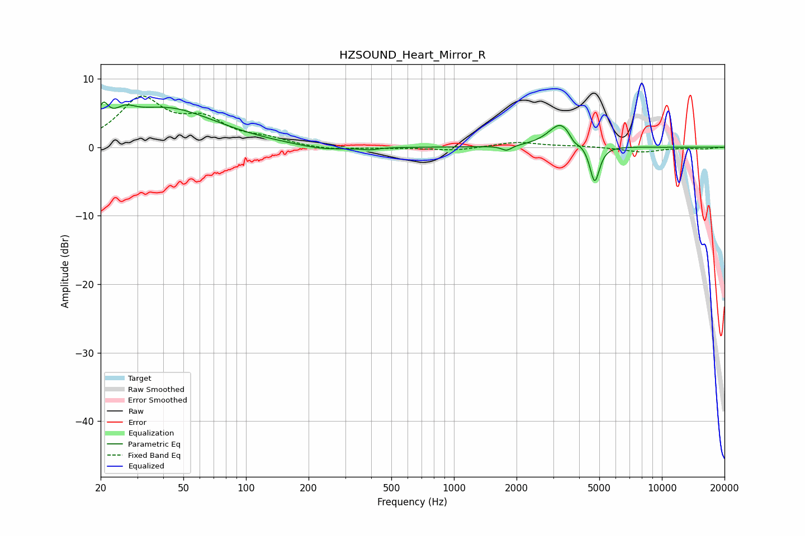

# HZSOUND_Heart_Mirror_R
See [usage instructions](https://github.com/jaakkopasanen/AutoEq#usage) for more options and info.

### Parametric EQs
Apply preamp of -6.7 dB when using parametric equalizer.

|   # | Type    |   Fc (Hz) |    Q |   Gain (dB) |
|-----|---------|-----------|------|-------------|
|   1 | Peaking |        21 | 6    |         2.9 |
|   2 | Peaking |        26 | 2.96 |         1.6 |
|   3 | Peaking |        41 | 0.58 |         5.6 |
|   4 | Peaking |       236 | 1.13 |        -0.7 |
|   5 | Peaking |       394 | 3.6  |        -0.3 |
|   6 | Peaking |      1791 | 5.96 |        -0.7 |
|   7 | Peaking |      3277 | 2.38 |         3.6 |
|   8 | Peaking |      3780 | 5.96 |        -1   |
|   9 | Peaking |      4752 | 5.98 |        -5.6 |
|  10 | Peaking |     10000 | 6    |        -0   |

### Fixed Band EQs
When using fixed band (also called graphic) equalizer, apply preamp of **-7.6 dB** (if available) and set gains manually with these parameters.

|   # | Type    |   Fc (Hz) |    Q |   Gain (dB) |
|-----|---------|-----------|------|-------------|
|   1 | Peaking |        31 | 1.41 |         6.8 |
|   2 | Peaking |        62 | 1.41 |         3.4 |
|   3 | Peaking |       125 | 1.41 |         1   |
|   4 | Peaking |       250 | 1.41 |        -0.4 |
|   5 | Peaking |       500 | 1.41 |        -0.1 |
|   6 | Peaking |      1000 | 1.41 |        -0.5 |
|   7 | Peaking |      2000 | 1.41 |         0.8 |
|   8 | Peaking |      4000 | 1.41 |         0.2 |
|   9 | Peaking |      8000 | 1.41 |        -0.7 |
|  10 | Peaking |     16000 | 1.41 |        -0.2 |

### Graphs

