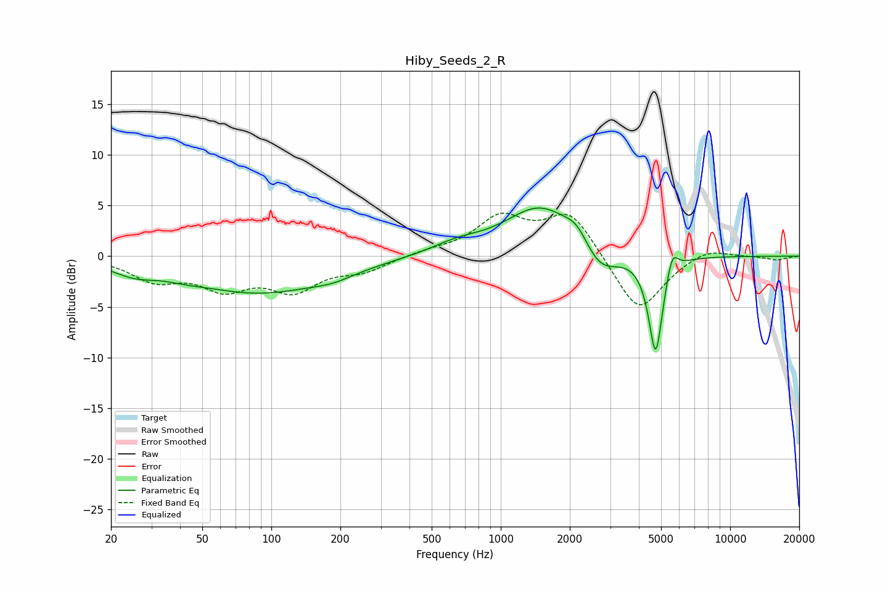

# Hiby_Seeds_2_R
See [usage instructions](https://github.com/jaakkopasanen/AutoEq#usage) for more options and info.

### Parametric EQs
Apply preamp of -4.8 dB when using parametric equalizer.

|   # | Type    |   Fc (Hz) |    Q |   Gain (dB) |
|-----|---------|-----------|------|-------------|
|   1 | Peaking |        25 | 1.49 |        -1.1 |
|   2 | Peaking |        42 | 1.75 |        -0.3 |
|   3 | Peaking |        89 | 0.47 |        -3.5 |
|   4 | Peaking |       186 | 1.6  |        -0.5 |
|   5 | Peaking |       640 | 1.23 |         1   |
|   6 | Peaking |      1493 | 0.92 |         4.9 |
|   7 | Peaking |      2151 | 2.77 |         1.5 |
|   8 | Peaking |      2694 | 1.76 |        -2.9 |
|   9 | Peaking |      4736 | 4.47 |        -9.8 |
|  10 | Peaking |      5587 | 5.79 |         2.3 |

### Fixed Band EQs
When using fixed band (also called graphic) equalizer, apply preamp of **-4.3 dB** (if available) and set gains manually with these parameters.

|   # | Type    |   Fc (Hz) |    Q |   Gain (dB) |
|-----|---------|-----------|------|-------------|
|   1 | Peaking |        31 | 1.41 |        -2.1 |
|   2 | Peaking |        62 | 1.41 |        -2.8 |
|   3 | Peaking |       125 | 1.41 |        -3   |
|   4 | Peaking |       250 | 1.41 |        -1.3 |
|   5 | Peaking |       500 | 1.41 |         0.4 |
|   6 | Peaking |      1000 | 1.41 |         3.6 |
|   7 | Peaking |      2000 | 1.41 |         4.4 |
|   8 | Peaking |      4000 | 1.41 |        -5.8 |
|   9 | Peaking |      8000 | 1.41 |         1   |
|  10 | Peaking |     16000 | 1.41 |        -0.4 |

### Graphs

