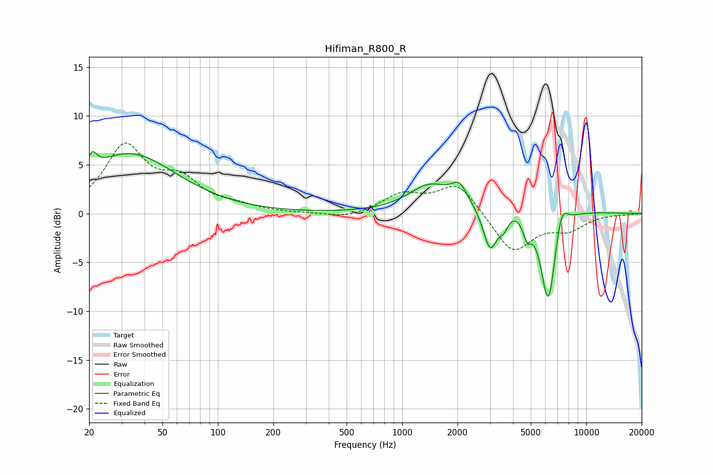

# Hifiman_R800_R
See [usage instructions](https://github.com/jaakkopasanen/AutoEq#usage) for more options and info.

### Parametric EQs
Apply preamp of -6.4 dB when using parametric equalizer.

|   # | Type    |   Fc (Hz) |    Q |   Gain (dB) |
|-----|---------|-----------|------|-------------|
|   1 | Peaking |        21 | 5.81 |         1.7 |
|   2 | Peaking |        33 | 0.56 |         6.1 |
|   3 | Peaking |      1408 | 1.24 |         2.6 |
|   4 | Peaking |      2046 | 3.34 |         1.8 |
|   5 | Peaking |      3011 | 3.52 |        -4.7 |
|   6 | Peaking |      3567 | 5.62 |        -1.3 |
|   7 | Peaking |      4485 | 0.65 |         1.6 |
|   8 | Peaking |      4775 | 6    |        -2   |
|   9 | Peaking |      6219 | 3.18 |       -10.4 |
|  10 | Peaking |      7327 | 4.1  |         2.7 |

### Fixed Band EQs
When using fixed band (also called graphic) equalizer, apply preamp of **-7.3 dB** (if available) and set gains manually with these parameters.

|   # | Type    |   Fc (Hz) |    Q |   Gain (dB) |
|-----|---------|-----------|------|-------------|
|   1 | Peaking |        31 | 1.41 |         6.6 |
|   2 | Peaking |        62 | 1.41 |         2.9 |
|   3 | Peaking |       125 | 1.41 |         0.6 |
|   4 | Peaking |       250 | 1.41 |        -0   |
|   5 | Peaking |       500 | 1.41 |        -0.5 |
|   6 | Peaking |      1000 | 1.41 |         1.8 |
|   7 | Peaking |      2000 | 1.41 |         3.1 |
|   8 | Peaking |      4000 | 1.41 |        -4.1 |
|   9 | Peaking |      8000 | 1.41 |        -1.5 |
|  10 | Peaking |     16000 | 1.41 |        -0.1 |

### Graphs

