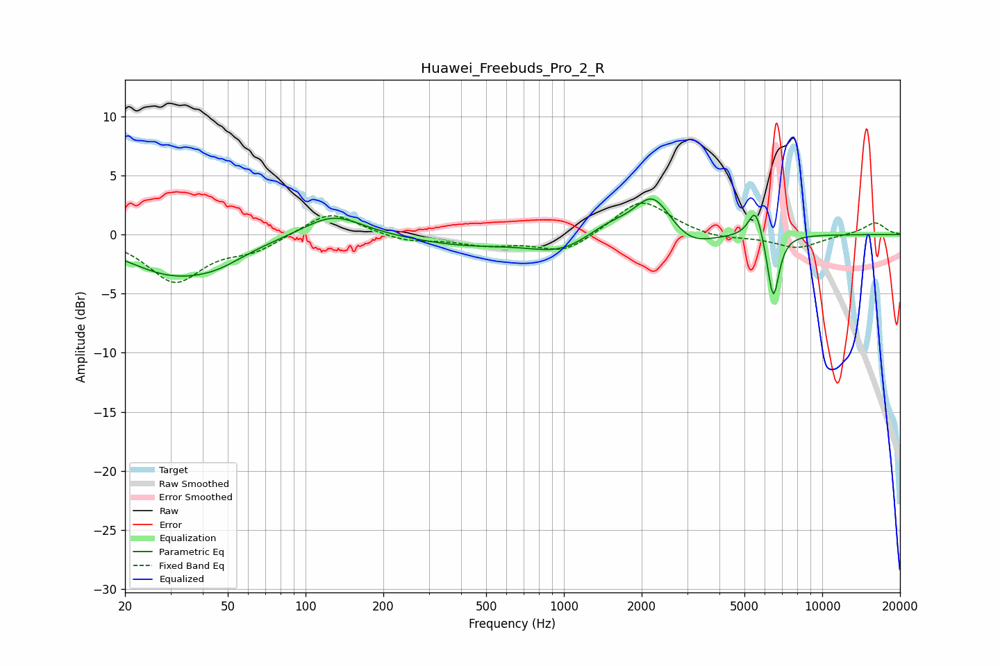

# Huawei_Freebuds_Pro_2_R
See [usage instructions](https://github.com/jaakkopasanen/AutoEq#usage) for more options and info.

### Parametric EQs
Apply preamp of -3.1 dB when using parametric equalizer.

|   # | Type    |   Fc (Hz) |    Q |   Gain (dB) |
|-----|---------|-----------|------|-------------|
|   1 | Peaking |        30 | 0.8  |        -3   |
|   2 | Peaking |        46 | 1.23 |        -1.1 |
|   3 | Peaking |       128 | 1.24 |         1.9 |
|   4 | Peaking |       410 | 0.68 |        -0.8 |
|   5 | Peaking |       987 | 1.13 |        -1.5 |
|   6 | Peaking |      1478 | 1.49 |         1.1 |
|   7 | Peaking |      2216 | 1.98 |         3.5 |
|   8 | Peaking |      3059 | 1.59 |        -1.3 |
|   9 | Peaking |      5518 | 5.12 |         2.7 |
|  10 | Peaking |      6462 | 6    |        -5.6 |

### Fixed Band EQs
When using fixed band (also called graphic) equalizer, apply preamp of **-2.7 dB** (if available) and set gains manually with these parameters.

|   # | Type    |   Fc (Hz) |    Q |   Gain (dB) |
|-----|---------|-----------|------|-------------|
|   1 | Peaking |        31 | 1.41 |        -3.9 |
|   2 | Peaking |        62 | 1.41 |        -1.2 |
|   3 | Peaking |       125 | 1.41 |         2.1 |
|   4 | Peaking |       250 | 1.41 |        -0.6 |
|   5 | Peaking |       500 | 1.41 |        -0.8 |
|   6 | Peaking |      1000 | 1.41 |        -1.6 |
|   7 | Peaking |      2000 | 1.41 |         3.1 |
|   8 | Peaking |      4000 | 1.41 |        -0.4 |
|   9 | Peaking |      8000 | 1.41 |        -1.1 |
|  10 | Peaking |     16000 | 1.41 |         1   |

### Graphs

