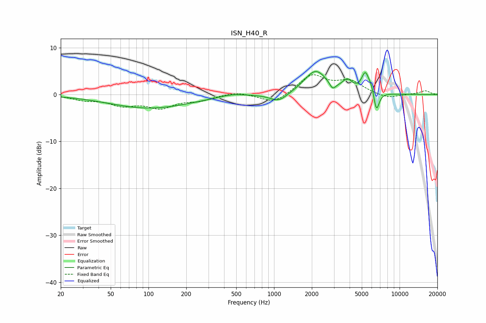

# ISN_H40_R
See [usage instructions](https://github.com/jaakkopasanen/AutoEq#usage) for more options and info.

### Parametric EQs
Apply preamp of -5.0 dB when using parametric equalizer.

|   # | Type    |   Fc (Hz) |    Q |   Gain (dB) |
|-----|---------|-----------|------|-------------|
|   1 | Peaking |        77 | 2.5  |        -0   |
|   2 | Peaking |       102 | 0.43 |        -2.9 |
|   3 | Peaking |       465 | 1.48 |         0.6 |
|   4 | Peaking |      1092 | 2.03 |        -1.8 |
|   5 | Peaking |      2143 | 1.58 |         5.1 |
|   6 | Peaking |      2928 | 5.98 |        -1.5 |
|   7 | Peaking |      3838 | 3.62 |         2.2 |
|   8 | Peaking |      5330 | 4.64 |         4.1 |
|   9 | Peaking |      5974 | 6    |         1.5 |
|  10 | Peaking |      6529 | 6    |        -4.5 |

### Fixed Band EQs
When using fixed band (also called graphic) equalizer, apply preamp of **-4.3 dB** (if available) and set gains manually with these parameters.

|   # | Type    |   Fc (Hz) |    Q |   Gain (dB) |
|-----|---------|-----------|------|-------------|
|   1 | Peaking |        31 | 1.41 |        -1   |
|   2 | Peaking |        62 | 1.41 |        -2   |
|   3 | Peaking |       125 | 1.41 |        -2.6 |
|   4 | Peaking |       250 | 1.41 |        -1.1 |
|   5 | Peaking |       500 | 1.41 |         0.7 |
|   6 | Peaking |      1000 | 1.41 |        -2.1 |
|   7 | Peaking |      2000 | 1.41 |         4.1 |
|   8 | Peaking |      4000 | 1.41 |         2.6 |
|   9 | Peaking |      8000 | 1.41 |        -0.9 |
|  10 | Peaking |     16000 | 1.41 |         0.8 |

### Graphs

