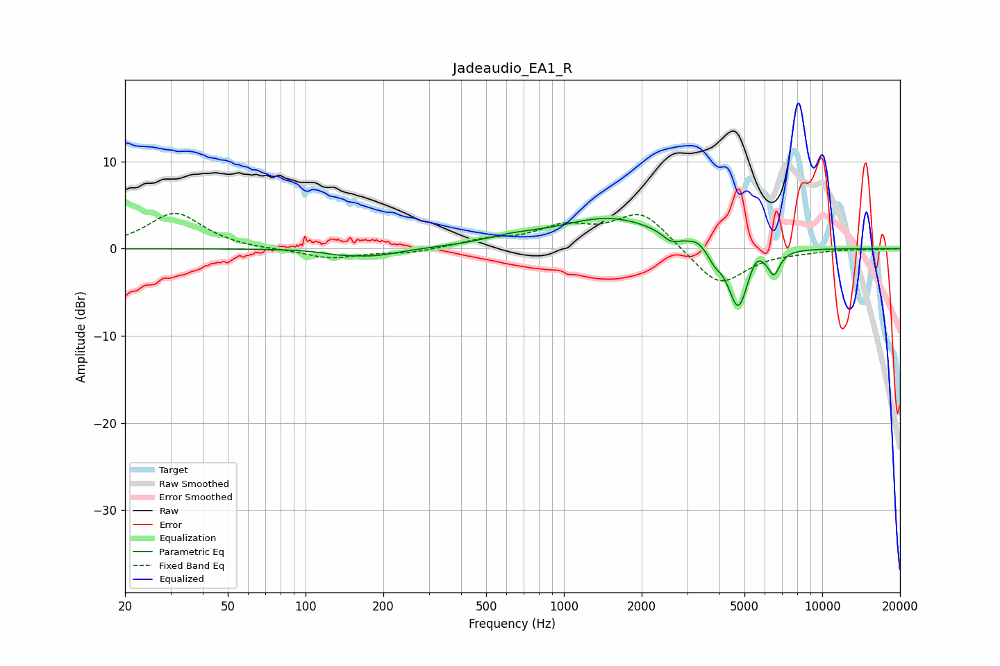

# Jadeaudio_EA1_R
See [usage instructions](https://github.com/jaakkopasanen/AutoEq#usage) for more options and info.

### Parametric EQs
Apply preamp of -3.6 dB when using parametric equalizer.

|   # | Type    |   Fc (Hz) |    Q |   Gain (dB) |
|-----|---------|-----------|------|-------------|
|   1 | Peaking |       133 | 2.39 |        -0.3 |
|   2 | Peaking |       181 | 1.34 |        -0.9 |
|   3 | Peaking |       622 | 1.31 |         0.7 |
|   4 | Peaking |      1515 | 0.69 |         3.5 |
|   5 | Peaking |      2594 | 4.44 |        -0.9 |
|   6 | Peaking |      3279 | 5.58 |         0.5 |
|   7 | Peaking |      3841 | 6    |        -1   |
|   8 | Peaking |      4730 | 3.42 |        -7.3 |
|   9 | Peaking |      5521 | 4.98 |         1.4 |
|  10 | Peaking |      6502 | 6    |        -2.6 |

### Fixed Band EQs
When using fixed band (also called graphic) equalizer, apply preamp of **-4.1 dB** (if available) and set gains manually with these parameters.

|   # | Type    |   Fc (Hz) |    Q |   Gain (dB) |
|-----|---------|-----------|------|-------------|
|   1 | Peaking |        31 | 1.41 |         4.1 |
|   2 | Peaking |        62 | 1.41 |        -0.1 |
|   3 | Peaking |       125 | 1.41 |        -1.1 |
|   4 | Peaking |       250 | 1.41 |        -0.5 |
|   5 | Peaking |       500 | 1.41 |         0.9 |
|   6 | Peaking |      1000 | 1.41 |         2.2 |
|   7 | Peaking |      2000 | 1.41 |         4.2 |
|   8 | Peaking |      4000 | 1.41 |        -4.4 |
|   9 | Peaking |      8000 | 1.41 |        -0.3 |
|  10 | Peaking |     16000 | 1.41 |        -0   |

### Graphs

