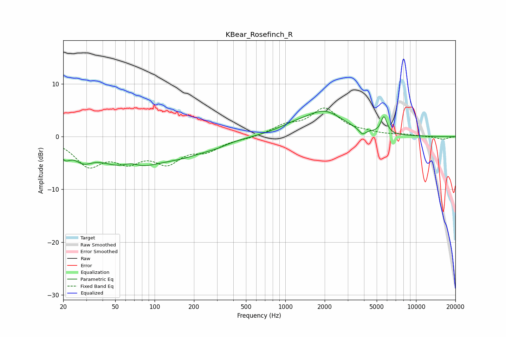

# KBear_Rosefinch_R
See [usage instructions](https://github.com/jaakkopasanen/AutoEq#usage) for more options and info.

### Parametric EQs
Apply preamp of -4.9 dB when using parametric equalizer.

|   # | Type    |   Fc (Hz) |    Q |   Gain (dB) |
|-----|---------|-----------|------|-------------|
|   1 | Peaking |        21 | 3.42 |        -2.3 |
|   2 | Peaking |        28 | 2.04 |        -2.4 |
|   3 | Peaking |        63 | 0.68 |        -5.9 |
|   4 | Peaking |        65 | 2.04 |         1.6 |
|   5 | Peaking |       169 | 0.73 |        -2.3 |
|   6 | Peaking |       296 | 1.56 |        -0.6 |
|   7 | Peaking |      1159 | 1.03 |         1.2 |
|   8 | Peaking |      2008 | 0.97 |         4.3 |
|   9 | Peaking |      3885 | 5.3  |        -1.1 |
|  10 | Peaking |      5681 | 6    |         3.2 |

### Fixed Band EQs
When using fixed band (also called graphic) equalizer, apply preamp of **-5.5 dB** (if available) and set gains manually with these parameters.

|   # | Type    |   Fc (Hz) |    Q |   Gain (dB) |
|-----|---------|-----------|------|-------------|
|   1 | Peaking |        31 | 1.41 |        -5.1 |
|   2 | Peaking |        62 | 1.41 |        -3.8 |
|   3 | Peaking |       125 | 1.41 |        -4.3 |
|   4 | Peaking |       250 | 1.41 |        -2.2 |
|   5 | Peaking |       500 | 1.41 |        -0.3 |
|   6 | Peaking |      1000 | 1.41 |         1.8 |
|   7 | Peaking |      2000 | 1.41 |         5.1 |
|   8 | Peaking |      4000 | 1.41 |         0.5 |
|   9 | Peaking |      8000 | 1.41 |         0.3 |
|  10 | Peaking |     16000 | 1.41 |        -0.5 |

### Graphs

