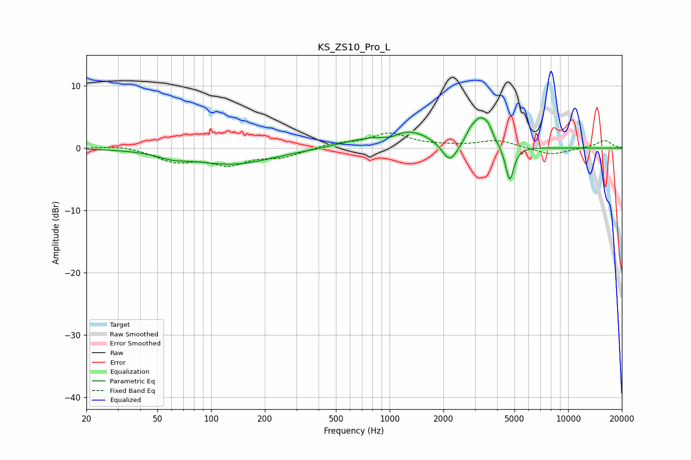

# KS_ZS10_Pro_L
See [usage instructions](https://github.com/jaakkopasanen/AutoEq#usage) for more options and info.

### Parametric EQs
Apply preamp of -5.0 dB when using parametric equalizer.

|   # | Type    |   Fc (Hz) |    Q |   Gain (dB) |
|-----|---------|-----------|------|-------------|
|   1 | Peaking |        61 | 1.72 |        -0.8 |
|   2 | Peaking |       132 | 0.64 |        -2.5 |
|   3 | Peaking |       663 | 1.11 |         0.8 |
|   4 | Peaking |      1013 | 3.02 |        -0.7 |
|   5 | Peaking |      1269 | 1    |         2.8 |
|   6 | Peaking |      2173 | 3.23 |        -3.4 |
|   7 | Peaking |      2831 | 5.4  |         1.1 |
|   8 | Peaking |      3219 | 3.19 |         4.2 |
|   9 | Peaking |      3583 | 6    |         1.4 |
|  10 | Peaking |      4705 | 6    |        -5.7 |

### Fixed Band EQs
When using fixed band (also called graphic) equalizer, apply preamp of **-2.5 dB** (if available) and set gains manually with these parameters.

|   # | Type    |   Fc (Hz) |    Q |   Gain (dB) |
|-----|---------|-----------|------|-------------|
|   1 | Peaking |        31 | 1.41 |         0.5 |
|   2 | Peaking |        62 | 1.41 |        -2   |
|   3 | Peaking |       125 | 1.41 |        -2.4 |
|   4 | Peaking |       250 | 1.41 |        -1.3 |
|   5 | Peaking |       500 | 1.41 |         0.7 |
|   6 | Peaking |      1000 | 1.41 |         2.3 |
|   7 | Peaking |      2000 | 1.41 |         0.2 |
|   8 | Peaking |      4000 | 1.41 |         1.2 |
|   9 | Peaking |      8000 | 1.41 |        -1.1 |
|  10 | Peaking |     16000 | 1.41 |         1.3 |

### Graphs

