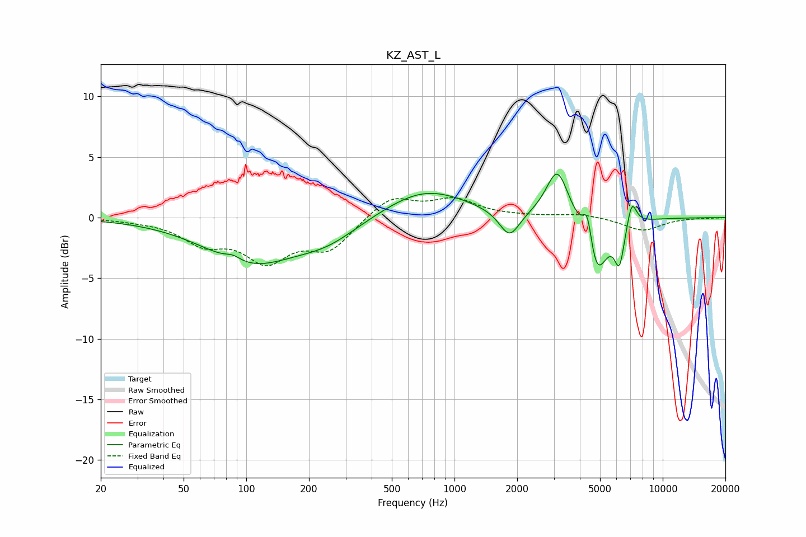

# KZ_AST_L
See [usage instructions](https://github.com/jaakkopasanen/AutoEq#usage) for more options and info.

### Parametric EQs
Apply preamp of -3.7 dB when using parametric equalizer.

|   # | Type    |   Fc (Hz) |    Q |   Gain (dB) |
|-----|---------|-----------|------|-------------|
|   1 | Peaking |        86 | 3.77 |         0.4 |
|   2 | Peaking |       105 | 0.64 |        -3.6 |
|   3 | Peaking |       246 | 0.92 |        -1.4 |
|   4 | Peaking |       725 | 0.71 |         2.4 |
|   5 | Peaking |      1837 | 2.9  |        -2.2 |
|   6 | Peaking |      3121 | 2.63 |         4.2 |
|   7 | Peaking |      4354 | 6    |         3.2 |
|   8 | Peaking |      4778 | 2.62 |        -5.3 |
|   9 | Peaking |      6197 | 5.81 |        -3.2 |
|  10 | Peaking |      7104 | 5.98 |         2.2 |

### Fixed Band EQs
When using fixed band (also called graphic) equalizer, apply preamp of **-1.7 dB** (if available) and set gains manually with these parameters.

|   # | Type    |   Fc (Hz) |    Q |   Gain (dB) |
|-----|---------|-----------|------|-------------|
|   1 | Peaking |        31 | 1.41 |        -0.1 |
|   2 | Peaking |        62 | 1.41 |        -1.9 |
|   3 | Peaking |       125 | 1.41 |        -3.3 |
|   4 | Peaking |       250 | 1.41 |        -2.5 |
|   5 | Peaking |       500 | 1.41 |         1.8 |
|   6 | Peaking |      1000 | 1.41 |         1.4 |
|   7 | Peaking |      2000 | 1.41 |         0.1 |
|   8 | Peaking |      4000 | 1.41 |         0.3 |
|   9 | Peaking |      8000 | 1.41 |        -1.1 |
|  10 | Peaking |     16000 | 1.41 |        -0   |

### Graphs

