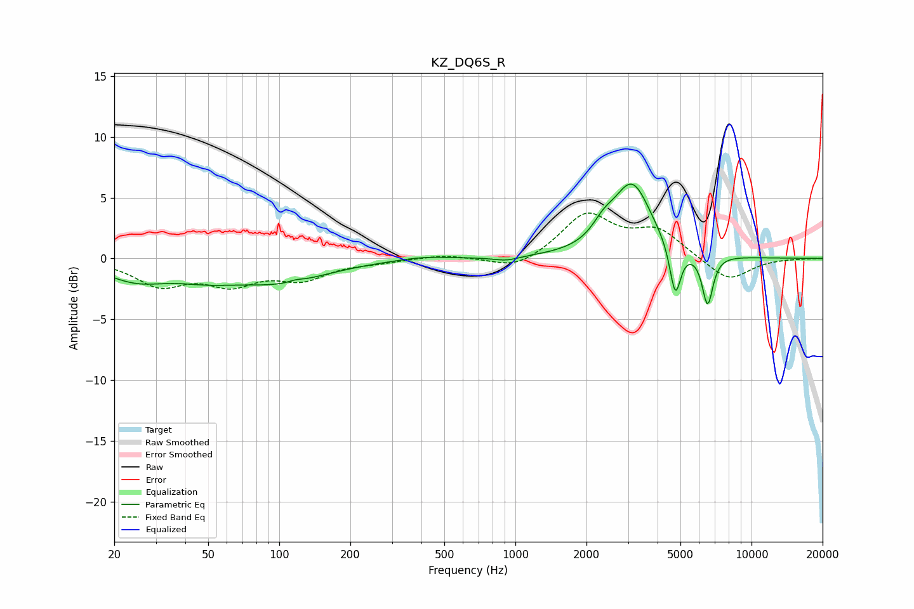

# KZ_DQ6S_R
See [usage instructions](https://github.com/jaakkopasanen/AutoEq#usage) for more options and info.

### Parametric EQs
Apply preamp of -6.2 dB when using parametric equalizer.

|   # | Type    |   Fc (Hz) |    Q |   Gain (dB) |
|-----|---------|-----------|------|-------------|
|   1 | Peaking |        25 | 1.07 |        -1.5 |
|   2 | Peaking |        49 | 0.98 |        -1   |
|   3 | Peaking |       102 | 0.72 |        -1.7 |
|   4 | Peaking |       118 | 4.85 |         0.2 |
|   5 | Peaking |       408 | 1.34 |         0.3 |
|   6 | Peaking |       916 | 2.59 |        -0.3 |
|   7 | Peaking |      2360 | 3.06 |         1.2 |
|   8 | Peaking |      3122 | 1.73 |         6   |
|   9 | Peaking |      4755 | 6    |        -4.2 |
|  10 | Peaking |      6515 | 6    |        -4.2 |

### Fixed Band EQs
When using fixed band (also called graphic) equalizer, apply preamp of **-3.8 dB** (if available) and set gains manually with these parameters.

|   # | Type    |   Fc (Hz) |    Q |   Gain (dB) |
|-----|---------|-----------|------|-------------|
|   1 | Peaking |        31 | 1.41 |        -2.1 |
|   2 | Peaking |        62 | 1.41 |        -1.9 |
|   3 | Peaking |       125 | 1.41 |        -1.5 |
|   4 | Peaking |       250 | 1.41 |        -0.2 |
|   5 | Peaking |       500 | 1.41 |         0.3 |
|   6 | Peaking |      1000 | 1.41 |        -1   |
|   7 | Peaking |      2000 | 1.41 |         3.6 |
|   8 | Peaking |      4000 | 1.41 |         2.2 |
|   9 | Peaking |      8000 | 1.41 |        -1.9 |
|  10 | Peaking |     16000 | 1.41 |        -0   |

### Graphs

