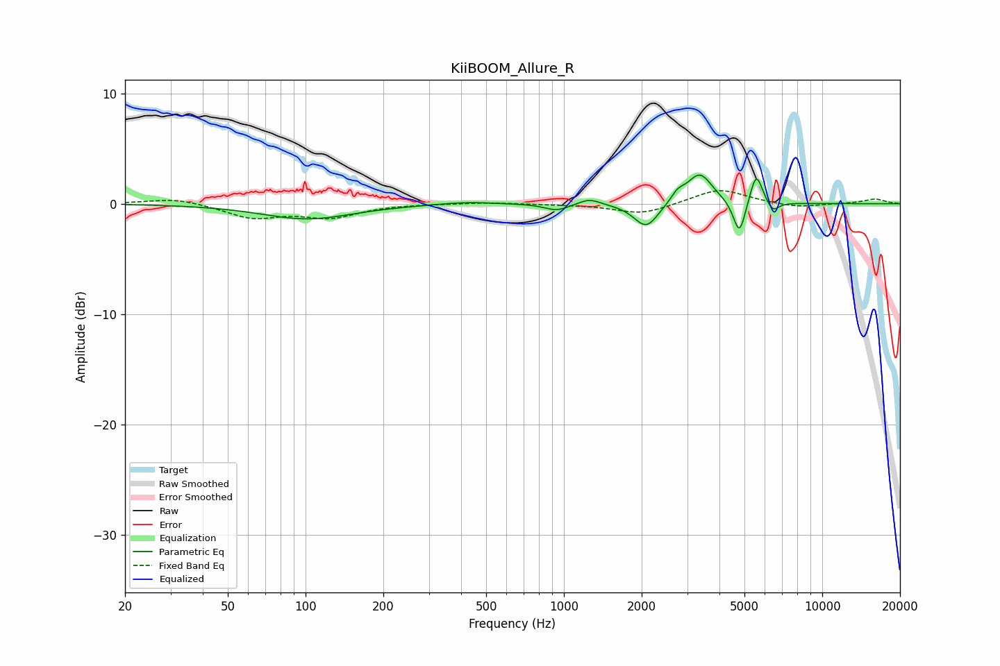

# KiiBOOM_Allure_R
See [usage instructions](https://github.com/jaakkopasanen/AutoEq#usage) for more options and info.

### Parametric EQs
Apply preamp of -2.7 dB when using parametric equalizer.

|   # | Type    |   Fc (Hz) |    Q |   Gain (dB) |
|-----|---------|-----------|------|-------------|
|   1 | Peaking |       102 | 0.8  |        -1.4 |
|   2 | Peaking |       417 | 1.32 |         0.2 |
|   3 | Peaking |       939 | 3.05 |        -0.6 |
|   4 | Peaking |      1254 | 3.36 |         0.6 |
|   5 | Peaking |      2084 | 3    |        -2.3 |
|   6 | Peaking |      2756 | 5.6  |         0.8 |
|   7 | Peaking |      3354 | 2.84 |         2.8 |
|   8 | Peaking |      4780 | 6    |        -3.2 |
|   9 | Peaking |      5552 | 5.87 |         2.9 |
|  10 | Peaking |      6439 | 6    |        -1   |

### Fixed Band EQs
When using fixed band (also called graphic) equalizer, apply preamp of **-1.3 dB** (if available) and set gains manually with these parameters.

|   # | Type    |   Fc (Hz) |    Q |   Gain (dB) |
|-----|---------|-----------|------|-------------|
|   1 | Peaking |        31 | 1.41 |         0.5 |
|   2 | Peaking |        62 | 1.41 |        -1.2 |
|   3 | Peaking |       125 | 1.41 |        -1.2 |
|   4 | Peaking |       250 | 1.41 |        -0   |
|   5 | Peaking |       500 | 1.41 |         0.1 |
|   6 | Peaking |      1000 | 1.41 |        -0   |
|   7 | Peaking |      2000 | 1.41 |        -1   |
|   8 | Peaking |      4000 | 1.41 |         1.4 |
|   9 | Peaking |      8000 | 1.41 |        -0.4 |
|  10 | Peaking |     16000 | 1.41 |         0.4 |

### Graphs

