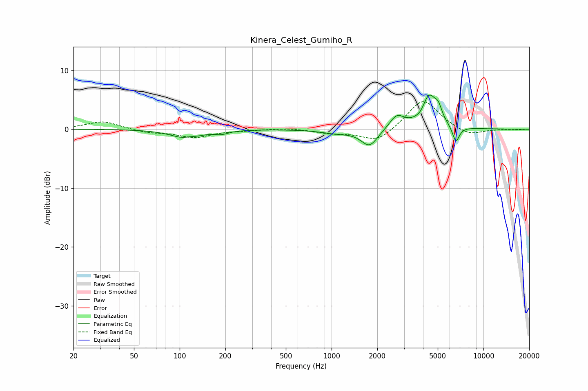

# Kinera_Celest_Gumiho_R
See [usage instructions](https://github.com/jaakkopasanen/AutoEq#usage) for more options and info.

### Parametric EQs
Apply preamp of -5.9 dB when using parametric equalizer.

|   # | Type    |   Fc (Hz) |    Q |   Gain (dB) |
|-----|---------|-----------|------|-------------|
|   1 | Peaking |       110 | 1.48 |        -1.5 |
|   2 | Peaking |       116 | 4.46 |         0.3 |
|   3 | Peaking |       189 | 3.22 |        -0.5 |
|   4 | Peaking |      1074 | 1.4  |        -0.6 |
|   5 | Peaking |      1778 | 2.55 |        -2.9 |
|   6 | Peaking |      2688 | 2.93 |         2.3 |
|   7 | Peaking |      3906 | 4.56 |        -0.8 |
|   8 | Peaking |      4371 | 2.79 |         5.7 |
|   9 | Peaking |      5050 | 6    |         1.8 |
|  10 | Peaking |      6584 | 5.91 |        -2.8 |

### Fixed Band EQs
When using fixed band (also called graphic) equalizer, apply preamp of **-4.8 dB** (if available) and set gains manually with these parameters.

|   # | Type    |   Fc (Hz) |    Q |   Gain (dB) |
|-----|---------|-----------|------|-------------|
|   1 | Peaking |        31 | 1.41 |         1.4 |
|   2 | Peaking |        62 | 1.41 |        -0.6 |
|   3 | Peaking |       125 | 1.41 |        -1.3 |
|   4 | Peaking |       250 | 1.41 |        -0.2 |
|   5 | Peaking |       500 | 1.41 |         0.3 |
|   6 | Peaking |      1000 | 1.41 |        -0.6 |
|   7 | Peaking |      2000 | 1.41 |        -2.3 |
|   8 | Peaking |      4000 | 1.41 |         5.3 |
|   9 | Peaking |      8000 | 1.41 |        -1.2 |
|  10 | Peaking |     16000 | 1.41 |        -0.1 |

### Graphs

