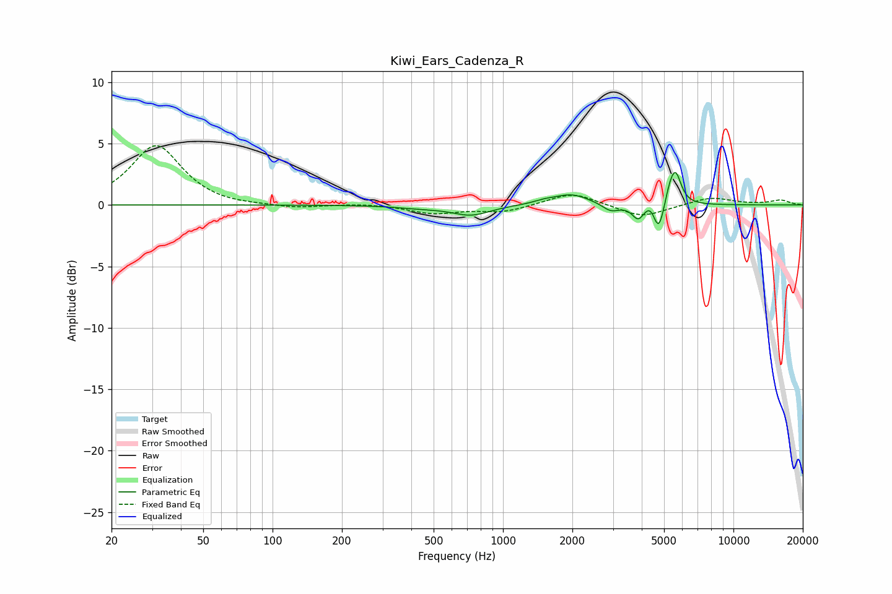

# Kiwi_Ears_Cadenza_R
See [usage instructions](https://github.com/jaakkopasanen/AutoEq#usage) for more options and info.

### Parametric EQs
Apply preamp of -2.7 dB when using parametric equalizer.

|   # | Type    |   Fc (Hz) |    Q |   Gain (dB) |
|-----|---------|-----------|------|-------------|
|   1 | Peaking |       441 | 1.33 |        -0.2 |
|   2 | Peaking |       728 | 1.74 |        -0.8 |
|   3 | Peaking |      1506 | 3.08 |         0.2 |
|   4 | Peaking |      1983 | 1.83 |         0.9 |
|   5 | Peaking |      2936 | 3.9  |        -0.6 |
|   6 | Peaking |      3860 | 5.47 |        -1.2 |
|   7 | Peaking |      4358 | 6    |         0.6 |
|   8 | Peaking |      4745 | 6    |        -2.4 |
|   9 | Peaking |      5299 | 6    |         1.1 |
|  10 | Peaking |      5621 | 5.76 |         2.3 |

### Fixed Band EQs
When using fixed band (also called graphic) equalizer, apply preamp of **-4.9 dB** (if available) and set gains manually with these parameters.

|   # | Type    |   Fc (Hz) |    Q |   Gain (dB) |
|-----|---------|-----------|------|-------------|
|   1 | Peaking |        31 | 1.41 |         4.9 |
|   2 | Peaking |        62 | 1.41 |        -0.2 |
|   3 | Peaking |       125 | 1.41 |        -0.3 |
|   4 | Peaking |       250 | 1.41 |         0.1 |
|   5 | Peaking |       500 | 1.41 |        -0.7 |
|   6 | Peaking |      1000 | 1.41 |        -0.6 |
|   7 | Peaking |      2000 | 1.41 |         1.1 |
|   8 | Peaking |      4000 | 1.41 |        -1   |
|   9 | Peaking |      8000 | 1.41 |         0.6 |
|  10 | Peaking |     16000 | 1.41 |         0.4 |

### Graphs

