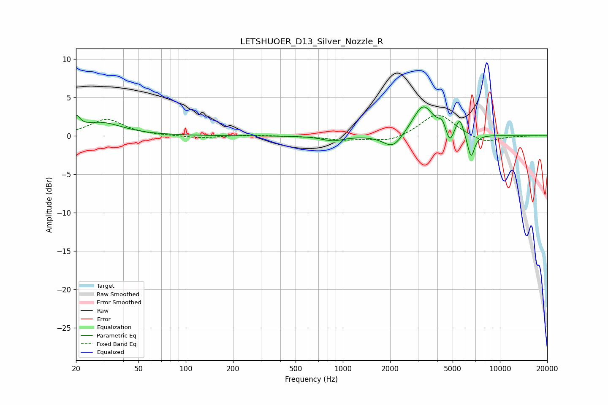

# LETSHUOER_D13_Silver_Nozzle_R
See [usage instructions](https://github.com/jaakkopasanen/AutoEq#usage) for more options and info.

### Parametric EQs
Apply preamp of -3.9 dB when using parametric equalizer.

|   # | Type    |   Fc (Hz) |    Q |   Gain (dB) |
|-----|---------|-----------|------|-------------|
|   1 | Peaking |        20 | 5.9  |         1.6 |
|   2 | Peaking |        29 | 1.05 |         1.7 |
|   3 | Peaking |       862 | 2.02 |        -0.6 |
|   4 | Peaking |      2084 | 2.3  |        -1.9 |
|   5 | Peaking |      3239 | 2.03 |         3.7 |
|   6 | Peaking |      3258 | 3.32 |         0.4 |
|   7 | Peaking |      4288 | 6    |         1.1 |
|   8 | Peaking |      4792 | 6    |        -1.9 |
|   9 | Peaking |      5547 | 5.63 |         2.2 |
|  10 | Peaking |      6545 | 6    |        -3.2 |

### Fixed Band EQs
When using fixed band (also called graphic) equalizer, apply preamp of **-2.8 dB** (if available) and set gains manually with these parameters.

|   # | Type    |   Fc (Hz) |    Q |   Gain (dB) |
|-----|---------|-----------|------|-------------|
|   1 | Peaking |        31 | 1.41 |         2.2 |
|   2 | Peaking |        62 | 1.41 |        -0   |
|   3 | Peaking |       125 | 1.41 |        -0.3 |
|   4 | Peaking |       250 | 1.41 |         0.1 |
|   5 | Peaking |       500 | 1.41 |        -0   |
|   6 | Peaking |      1000 | 1.41 |        -0.5 |
|   7 | Peaking |      2000 | 1.41 |        -0.8 |
|   8 | Peaking |      4000 | 1.41 |         3   |
|   9 | Peaking |      8000 | 1.41 |        -1   |
|  10 | Peaking |     16000 | 1.41 |         0   |

### Graphs

