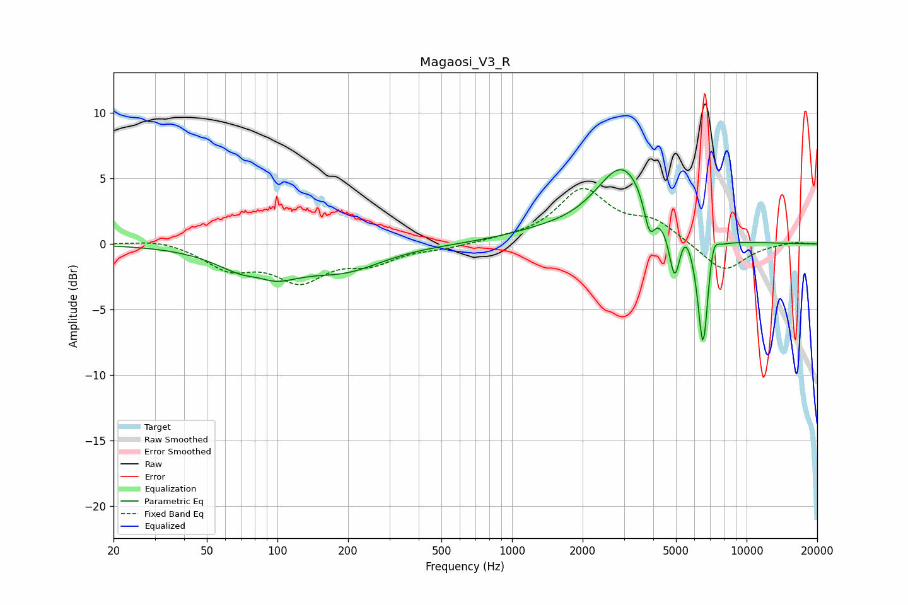

# Magaosi_V3_R
See [usage instructions](https://github.com/jaakkopasanen/AutoEq#usage) for more options and info.

### Parametric EQs
Apply preamp of -5.8 dB when using parametric equalizer.

|   # | Type    |   Fc (Hz) |    Q |   Gain (dB) |
|-----|---------|-----------|------|-------------|
|   1 | Peaking |        83 | 2.07 |         1.1 |
|   2 | Peaking |        85 | 1.07 |        -3.3 |
|   3 | Peaking |       196 | 0.88 |        -1.7 |
|   4 | Peaking |      1361 | 0.79 |         0.6 |
|   5 | Peaking |      2977 | 1.22 |         5.8 |
|   6 | Peaking |      3858 | 6    |        -2.6 |
|   7 | Peaking |      4933 | 6    |        -4   |
|   8 | Peaking |      5478 | 5.22 |         1   |
|   9 | Peaking |      6527 | 5.91 |        -9   |
|  10 | Peaking |      7174 | 6    |         1.9 |

### Fixed Band EQs
When using fixed band (also called graphic) equalizer, apply preamp of **-4.3 dB** (if available) and set gains manually with these parameters.

|   # | Type    |   Fc (Hz) |    Q |   Gain (dB) |
|-----|---------|-----------|------|-------------|
|   1 | Peaking |        31 | 1.41 |         0.4 |
|   2 | Peaking |        62 | 1.41 |        -1.7 |
|   3 | Peaking |       125 | 1.41 |        -2.6 |
|   4 | Peaking |       250 | 1.41 |        -1.3 |
|   5 | Peaking |       500 | 1.41 |        -0.3 |
|   6 | Peaking |      1000 | 1.41 |         0.2 |
|   7 | Peaking |      2000 | 1.41 |         4   |
|   8 | Peaking |      4000 | 1.41 |         1.5 |
|   9 | Peaking |      8000 | 1.41 |        -2.2 |
|  10 | Peaking |     16000 | 1.41 |         0.2 |

### Graphs

