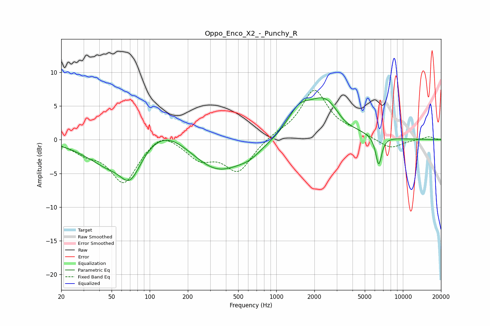

# Oppo_Enco_X2_-_Punchy_R
See [usage instructions](https://github.com/jaakkopasanen/AutoEq#usage) for more options and info.

### Parametric EQs
Apply preamp of -6.3 dB when using parametric equalizer.

|   # | Type    |   Fc (Hz) |    Q |   Gain (dB) |
|-----|---------|-----------|------|-------------|
|   1 | Peaking |        36 | 0.92 |        -1.7 |
|   2 | Peaking |        46 | 1.6  |        -1.2 |
|   3 | Peaking |        70 | 1.55 |        -5.7 |
|   4 | Peaking |       131 | 0.8  |         2.7 |
|   5 | Peaking |       344 | 0.68 |        -4.8 |
|   6 | Peaking |       616 | 1.54 |        -1   |
|   7 | Peaking |      1502 | 1.56 |         3.3 |
|   8 | Peaking |      2420 | 1.06 |         5.6 |
|   9 | Peaking |      3440 | 2.14 |        -0.7 |
|  10 | Peaking |      6440 | 5.68 |        -4.3 |

### Fixed Band EQs
When using fixed band (also called graphic) equalizer, apply preamp of **-7.4 dB** (if available) and set gains manually with these parameters.

|   # | Type    |   Fc (Hz) |    Q |   Gain (dB) |
|-----|---------|-----------|------|-------------|
|   1 | Peaking |        31 | 1.41 |        -1.5 |
|   2 | Peaking |        62 | 1.41 |        -6.3 |
|   3 | Peaking |       125 | 1.41 |         1.8 |
|   4 | Peaking |       250 | 1.41 |        -2.6 |
|   5 | Peaking |       500 | 1.41 |        -4.6 |
|   6 | Peaking |      1000 | 1.41 |         0.7 |
|   7 | Peaking |      2000 | 1.41 |         7.3 |
|   8 | Peaking |      4000 | 1.41 |         0.8 |
|   9 | Peaking |      8000 | 1.41 |        -1.4 |
|  10 | Peaking |     16000 | 1.41 |         0.5 |

### Graphs

