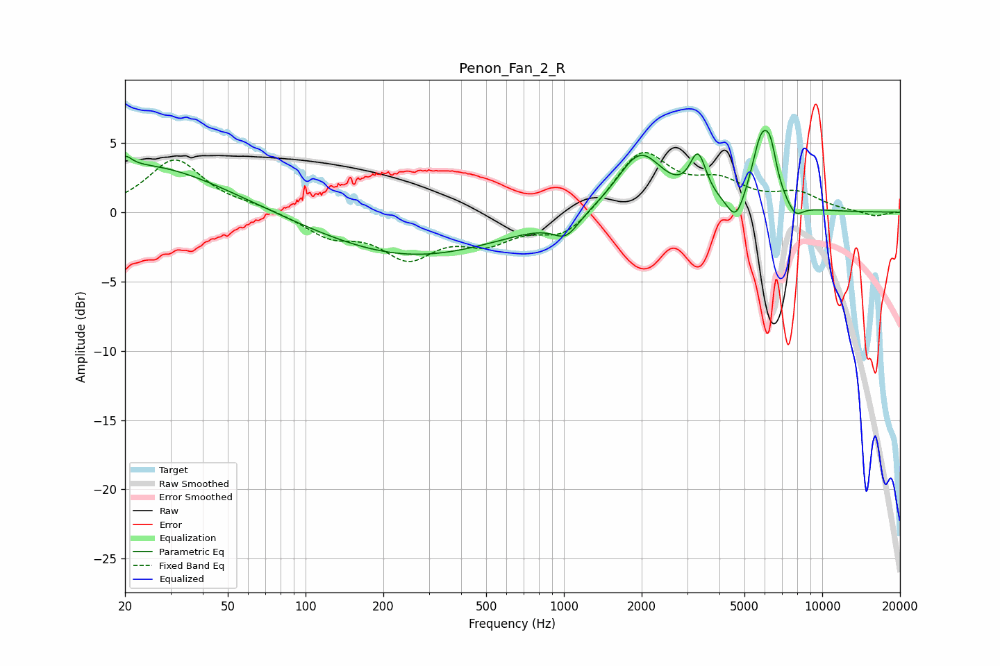

# Penon_Fan_2_R
See [usage instructions](https://github.com/jaakkopasanen/AutoEq#usage) for more options and info.

### Parametric EQs
Apply preamp of -6.0 dB when using parametric equalizer.

|   # | Type    |   Fc (Hz) |    Q |   Gain (dB) |
|-----|---------|-----------|------|-------------|
|   1 | Peaking |        20 | 5.55 |         0.8 |
|   2 | Peaking |        24 | 0.46 |         3.5 |
|   3 | Peaking |       258 | 0.4  |        -3.2 |
|   4 | Peaking |      1020 | 2.82 |        -1.4 |
|   5 | Peaking |      1973 | 1.56 |         4.3 |
|   6 | Peaking |      3306 | 4.43 |         3.2 |
|   7 | Peaking |      4635 | 4.16 |        -1.9 |
|   8 | Peaking |      5819 | 3.55 |         4.8 |
|   9 | Peaking |      6319 | 5.81 |         2.2 |
|  10 | Peaking |      7857 | 4.32 |        -0.9 |

### Fixed Band EQs
When using fixed band (also called graphic) equalizer, apply preamp of **-4.4 dB** (if available) and set gains manually with these parameters.

|   # | Type    |   Fc (Hz) |    Q |   Gain (dB) |
|-----|---------|-----------|------|-------------|
|   1 | Peaking |        31 | 1.41 |         3.8 |
|   2 | Peaking |        62 | 1.41 |         0.4 |
|   3 | Peaking |       125 | 1.41 |        -1.6 |
|   4 | Peaking |       250 | 1.41 |        -3   |
|   5 | Peaking |       500 | 1.41 |        -1.8 |
|   6 | Peaking |      1000 | 1.41 |        -1.9 |
|   7 | Peaking |      2000 | 1.41 |         4.4 |
|   8 | Peaking |      4000 | 1.41 |         1.8 |
|   9 | Peaking |      8000 | 1.41 |         1.2 |
|  10 | Peaking |     16000 | 1.41 |        -0.3 |

### Graphs

