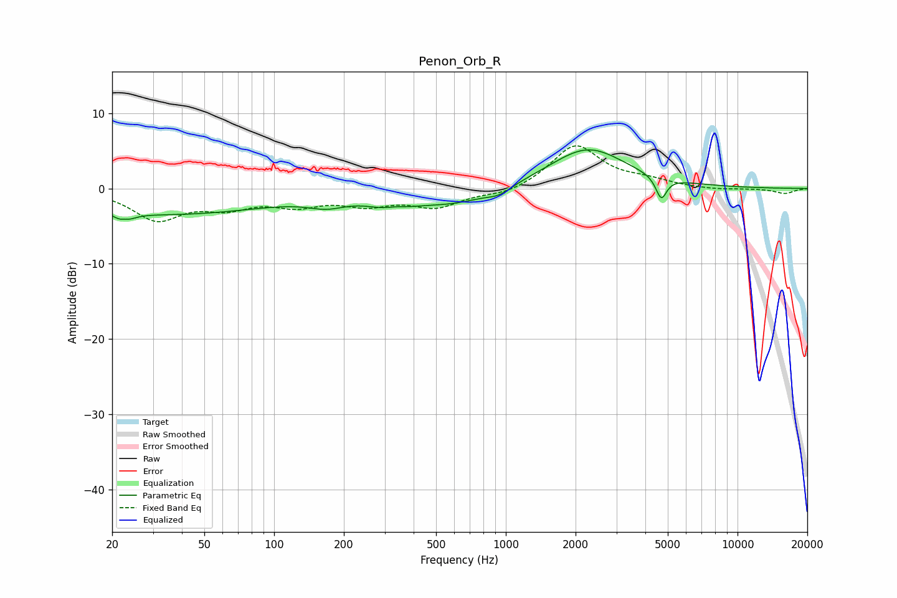

# Penon_Orb_R
See [usage instructions](https://github.com/jaakkopasanen/AutoEq#usage) for more options and info.

### Parametric EQs
Apply preamp of -5.2 dB when using parametric equalizer.

|   # | Type    |   Fc (Hz) |    Q |   Gain (dB) |
|-----|---------|-----------|------|-------------|
|   1 | Peaking |        23 | 4.95 |        -3.8 |
|   2 | Peaking |        23 | 5.96 |         2.9 |
|   3 | Peaking |        35 | 0.31 |        -3.4 |
|   4 | Peaking |       169 | 1.69 |        -1.2 |
|   5 | Peaking |       325 | 1.69 |        -2.6 |
|   6 | Peaking |       332 | 2.5  |         1.4 |
|   7 | Peaking |       598 | 0.89 |        -1.9 |
|   8 | Peaking |       935 | 2.61 |        -0.9 |
|   9 | Peaking |      2258 | 0.85 |         5.4 |
|  10 | Peaking |      4687 | 6    |        -3   |

### Fixed Band EQs
When using fixed band (also called graphic) equalizer, apply preamp of **-5.8 dB** (if available) and set gains manually with these parameters.

|   # | Type    |   Fc (Hz) |    Q |   Gain (dB) |
|-----|---------|-----------|------|-------------|
|   1 | Peaking |        31 | 1.41 |        -3.9 |
|   2 | Peaking |        62 | 1.41 |        -2.1 |
|   3 | Peaking |       125 | 1.41 |        -1.9 |
|   4 | Peaking |       250 | 1.41 |        -1.8 |
|   5 | Peaking |       500 | 1.41 |        -2.3 |
|   6 | Peaking |      1000 | 1.41 |        -0.9 |
|   7 | Peaking |      2000 | 1.41 |         5.8 |
|   8 | Peaking |      4000 | 1.41 |         0.9 |
|   9 | Peaking |      8000 | 1.41 |        -0.2 |
|  10 | Peaking |     16000 | 1.41 |        -0.7 |

### Graphs

