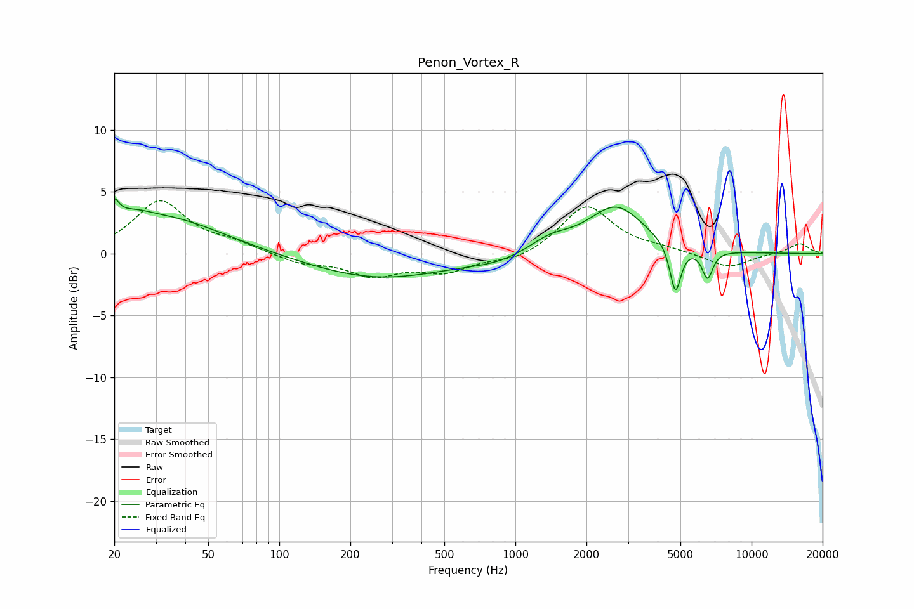

# Penon_Vortex_R
See [usage instructions](https://github.com/jaakkopasanen/AutoEq#usage) for more options and info.

### Parametric EQs
Apply preamp of -4.6 dB when using parametric equalizer.

|   # | Type    |   Fc (Hz) |    Q |   Gain (dB) |
|-----|---------|-----------|------|-------------|
|   1 | Peaking |        20 | 5.84 |         3.2 |
|   2 | Peaking |        20 | 6    |        -1.4 |
|   3 | Peaking |        24 | 1.98 |         0.7 |
|   4 | Peaking |        32 | 0.55 |         2.9 |
|   5 | Peaking |       262 | 0.48 |        -2   |
|   6 | Peaking |       842 | 1.15 |        -0.5 |
|   7 | Peaking |      1402 | 1.59 |         1   |
|   8 | Peaking |      2669 | 1.19 |         3.8 |
|   9 | Peaking |      4761 | 6    |        -4   |
|  10 | Peaking |      6507 | 6    |        -2.3 |

### Fixed Band EQs
When using fixed band (also called graphic) equalizer, apply preamp of **-4.4 dB** (if available) and set gains manually with these parameters.

|   # | Type    |   Fc (Hz) |    Q |   Gain (dB) |
|-----|---------|-----------|------|-------------|
|   1 | Peaking |        31 | 1.41 |         4.2 |
|   2 | Peaking |        62 | 1.41 |         0.7 |
|   3 | Peaking |       125 | 1.41 |        -0.7 |
|   4 | Peaking |       250 | 1.41 |        -1.7 |
|   5 | Peaking |       500 | 1.41 |        -1.3 |
|   6 | Peaking |      1000 | 1.41 |        -0.6 |
|   7 | Peaking |      2000 | 1.41 |         3.9 |
|   8 | Peaking |      4000 | 1.41 |         0.3 |
|   9 | Peaking |      8000 | 1.41 |        -1.2 |
|  10 | Peaking |     16000 | 1.41 |         0.8 |

### Graphs

