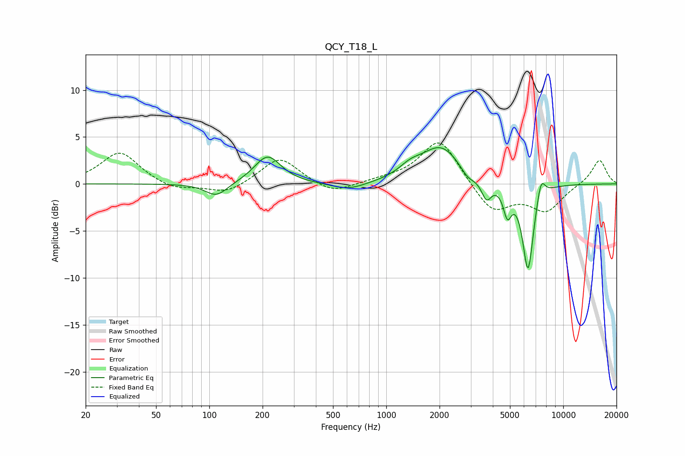

# QCY_T18_L
See [usage instructions](https://github.com/jaakkopasanen/AutoEq#usage) for more options and info.

### Parametric EQs
Apply preamp of -4.0 dB when using parametric equalizer.

|   # | Type    |   Fc (Hz) |    Q |   Gain (dB) |
|-----|---------|-----------|------|-------------|
|   1 | Peaking |       110 | 2.24 |        -1.4 |
|   2 | Peaking |       214 | 1.89 |         3   |
|   3 | Peaking |       612 | 1.41 |        -0.8 |
|   4 | Peaking |      1364 | 2.26 |         0.9 |
|   5 | Peaking |      2041 | 1.23 |         3.9 |
|   6 | Peaking |      2885 | 3.32 |        -1   |
|   7 | Peaking |      3684 | 4.95 |        -2   |
|   8 | Peaking |      4837 | 6    |        -2.8 |
|   9 | Peaking |      6325 | 4.37 |        -9.3 |
|  10 | Peaking |      7492 | 5.99 |         2.2 |

### Fixed Band EQs
When using fixed band (also called graphic) equalizer, apply preamp of **-4.5 dB** (if available) and set gains manually with these parameters.

|   # | Type    |   Fc (Hz) |    Q |   Gain (dB) |
|-----|---------|-----------|------|-------------|
|   1 | Peaking |        31 | 1.41 |         3.4 |
|   2 | Peaking |        62 | 1.41 |        -0.7 |
|   3 | Peaking |       125 | 1.41 |        -1.1 |
|   4 | Peaking |       250 | 1.41 |         2.9 |
|   5 | Peaking |       500 | 1.41 |        -1.2 |
|   6 | Peaking |      1000 | 1.41 |         0.3 |
|   7 | Peaking |      2000 | 1.41 |         4.9 |
|   8 | Peaking |      4000 | 1.41 |        -3.1 |
|   9 | Peaking |      8000 | 1.41 |        -2.8 |
|  10 | Peaking |     16000 | 1.41 |         2.6 |

### Graphs

