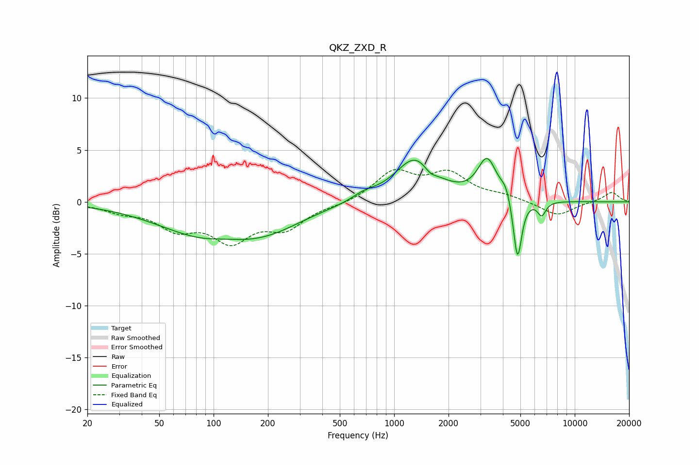

# QKZ_ZXD_R
See [usage instructions](https://github.com/jaakkopasanen/AutoEq#usage) for more options and info.

### Parametric EQs
Apply preamp of -4.3 dB when using parametric equalizer.

|   # | Type    |   Fc (Hz) |    Q |   Gain (dB) |
|-----|---------|-----------|------|-------------|
|   1 | Peaking |       111 | 0.47 |        -4   |
|   2 | Peaking |       115 | 1.27 |         0.6 |
|   3 | Peaking |       221 | 0.92 |        -0.6 |
|   4 | Peaking |       682 | 2.1  |         0.6 |
|   5 | Peaking |      1314 | 1.26 |         4.2 |
|   6 | Peaking |      1583 | 3.75 |        -0.7 |
|   7 | Peaking |      3272 | 2.71 |         3.8 |
|   8 | Peaking |      4156 | 5.02 |         1.1 |
|   9 | Peaking |      4822 | 6    |        -6.2 |
|  10 | Peaking |      6560 | 6    |        -1.3 |

### Fixed Band EQs
When using fixed band (also called graphic) equalizer, apply preamp of **-3.2 dB** (if available) and set gains manually with these parameters.

|   # | Type    |   Fc (Hz) |    Q |   Gain (dB) |
|-----|---------|-----------|------|-------------|
|   1 | Peaking |        31 | 1.41 |        -0.8 |
|   2 | Peaking |        62 | 1.41 |        -2.3 |
|   3 | Peaking |       125 | 1.41 |        -3.4 |
|   4 | Peaking |       250 | 1.41 |        -2.3 |
|   5 | Peaking |       500 | 1.41 |        -0.3 |
|   6 | Peaking |      1000 | 1.41 |         2.8 |
|   7 | Peaking |      2000 | 1.41 |         2.5 |
|   8 | Peaking |      4000 | 1.41 |         0.5 |
|   9 | Peaking |      8000 | 1.41 |        -1.4 |
|  10 | Peaking |     16000 | 1.41 |         1   |

### Graphs

