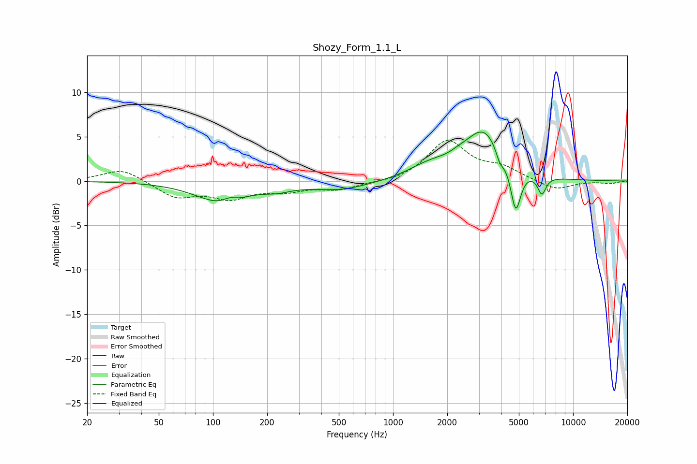

# Shozy_Form_1.1_L
See [usage instructions](https://github.com/jaakkopasanen/AutoEq#usage) for more options and info.

### Parametric EQs
Apply preamp of -5.6 dB when using parametric equalizer.

|   # | Type    |   Fc (Hz) |    Q |   Gain (dB) |
|-----|---------|-----------|------|-------------|
|   1 | Peaking |       111 | 1    |        -2.3 |
|   2 | Peaking |       123 | 4.29 |         0.5 |
|   3 | Peaking |       228 | 1.92 |        -0.5 |
|   4 | Peaking |       511 | 0.88 |        -1   |
|   5 | Peaking |      1581 | 1.23 |         1.4 |
|   6 | Peaking |      2309 | 2.65 |         0.4 |
|   7 | Peaking |      3203 | 1.3  |         5.6 |
|   8 | Peaking |      3920 | 6    |        -1.4 |
|   9 | Peaking |      4800 | 4.89 |        -5.3 |
|  10 | Peaking |      6706 | 6    |        -2   |

### Fixed Band EQs
When using fixed band (also called graphic) equalizer, apply preamp of **-4.7 dB** (if available) and set gains manually with these parameters.

|   # | Type    |   Fc (Hz) |    Q |   Gain (dB) |
|-----|---------|-----------|------|-------------|
|   1 | Peaking |        31 | 1.41 |         1.4 |
|   2 | Peaking |        62 | 1.41 |        -1.8 |
|   3 | Peaking |       125 | 1.41 |        -1.7 |
|   4 | Peaking |       250 | 1.41 |        -0.9 |
|   5 | Peaking |       500 | 1.41 |        -0.9 |
|   6 | Peaking |      1000 | 1.41 |        -0.2 |
|   7 | Peaking |      2000 | 1.41 |         4.5 |
|   8 | Peaking |      4000 | 1.41 |         1.3 |
|   9 | Peaking |      8000 | 1.41 |        -1.1 |
|  10 | Peaking |     16000 | 1.41 |        -0.3 |

### Graphs

