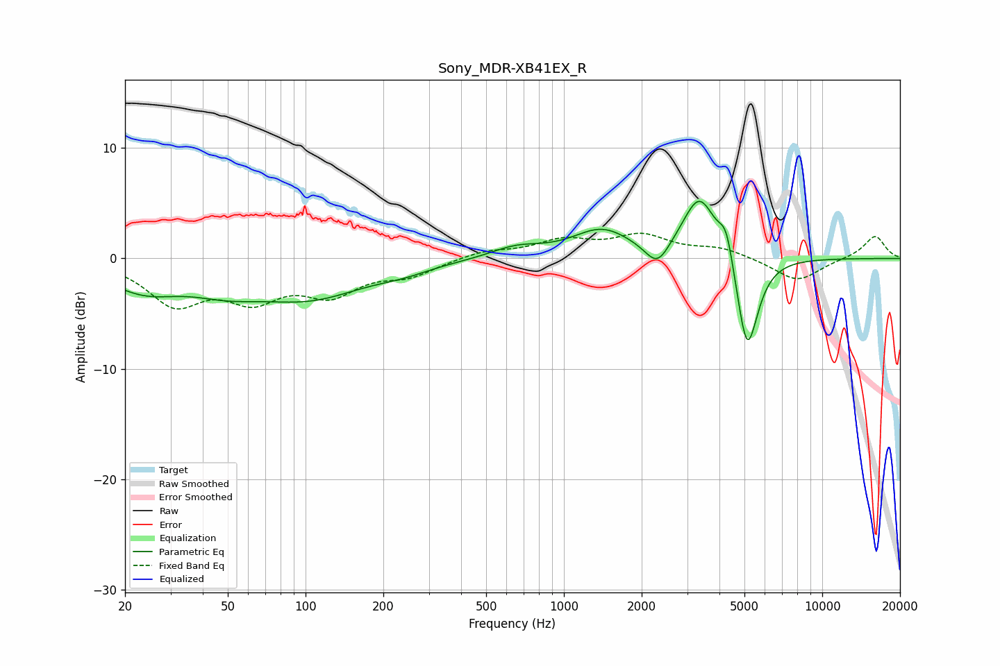

# Sony_MDR-XB41EX_R
See [usage instructions](https://github.com/jaakkopasanen/AutoEq#usage) for more options and info.

### Parametric EQs
Apply preamp of -5.3 dB when using parametric equalizer.

|   # | Type    |   Fc (Hz) |    Q |   Gain (dB) |
|-----|---------|-----------|------|-------------|
|   1 | Peaking |        24 | 0.97 |        -2.5 |
|   2 | Peaking |        49 | 1    |        -1.6 |
|   3 | Peaking |       104 | 0.65 |        -3.2 |
|   4 | Peaking |       239 | 1.34 |        -0.5 |
|   5 | Peaking |       655 | 1.4  |         1   |
|   6 | Peaking |      1403 | 1.26 |         2.5 |
|   7 | Peaking |      2301 | 3.02 |        -2.3 |
|   8 | Peaking |      3351 | 2.13 |         5.8 |
|   9 | Peaking |      4256 | 4.92 |         3   |
|  10 | Peaking |      5122 | 3.25 |        -9.2 |

### Fixed Band EQs
When using fixed band (also called graphic) equalizer, apply preamp of **-2.4 dB** (if available) and set gains manually with these parameters.

|   # | Type    |   Fc (Hz) |    Q |   Gain (dB) |
|-----|---------|-----------|------|-------------|
|   1 | Peaking |        31 | 1.41 |        -3.9 |
|   2 | Peaking |        62 | 1.41 |        -3.2 |
|   3 | Peaking |       125 | 1.41 |        -2.8 |
|   4 | Peaking |       250 | 1.41 |        -1.4 |
|   5 | Peaking |       500 | 1.41 |         0.7 |
|   6 | Peaking |      1000 | 1.41 |         1.5 |
|   7 | Peaking |      2000 | 1.41 |         1.9 |
|   8 | Peaking |      4000 | 1.41 |         0.9 |
|   9 | Peaking |      8000 | 1.41 |        -2.1 |
|  10 | Peaking |     16000 | 1.41 |         2.1 |

### Graphs

