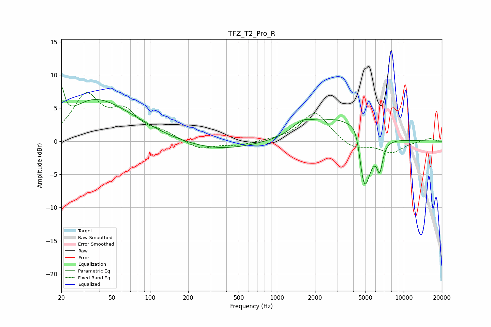

# TFZ_T2_Pro_R
See [usage instructions](https://github.com/jaakkopasanen/AutoEq#usage) for more options and info.

### Parametric EQs
Apply preamp of -8.3 dB when using parametric equalizer.

|   # | Type    |   Fc (Hz) |    Q |   Gain (dB) |
|-----|---------|-----------|------|-------------|
|   1 | Peaking |        20 | 6    |         4.7 |
|   2 | Peaking |        34 | 1.02 |         1.5 |
|   3 | Peaking |        44 | 0.5  |         5   |
|   4 | Peaking |       339 | 0.49 |        -1.4 |
|   5 | Peaking |      1605 | 1.64 |         1.8 |
|   6 | Peaking |      3224 | 0.68 |         3.7 |
|   7 | Peaking |      4305 | 2.76 |         3.6 |
|   8 | Peaking |      4767 | 4.71 |        -2.2 |
|   9 | Peaking |      4945 | 2.45 |        -9   |
|  10 | Peaking |      6474 | 5.99 |        -3.8 |

### Fixed Band EQs
When using fixed band (also called graphic) equalizer, apply preamp of **-7.4 dB** (if available) and set gains manually with these parameters.

|   # | Type    |   Fc (Hz) |    Q |   Gain (dB) |
|-----|---------|-----------|------|-------------|
|   1 | Peaking |        31 | 1.41 |         6.6 |
|   2 | Peaking |        62 | 1.41 |         3.9 |
|   3 | Peaking |       125 | 1.41 |         1.1 |
|   4 | Peaking |       250 | 1.41 |        -1.3 |
|   5 | Peaking |       500 | 1.41 |        -0.6 |
|   6 | Peaking |      1000 | 1.41 |         0.1 |
|   7 | Peaking |      2000 | 1.41 |         4.5 |
|   8 | Peaking |      4000 | 1.41 |        -1.3 |
|   9 | Peaking |      8000 | 1.41 |        -1.7 |
|  10 | Peaking |     16000 | 1.41 |         0.5 |

### Graphs

