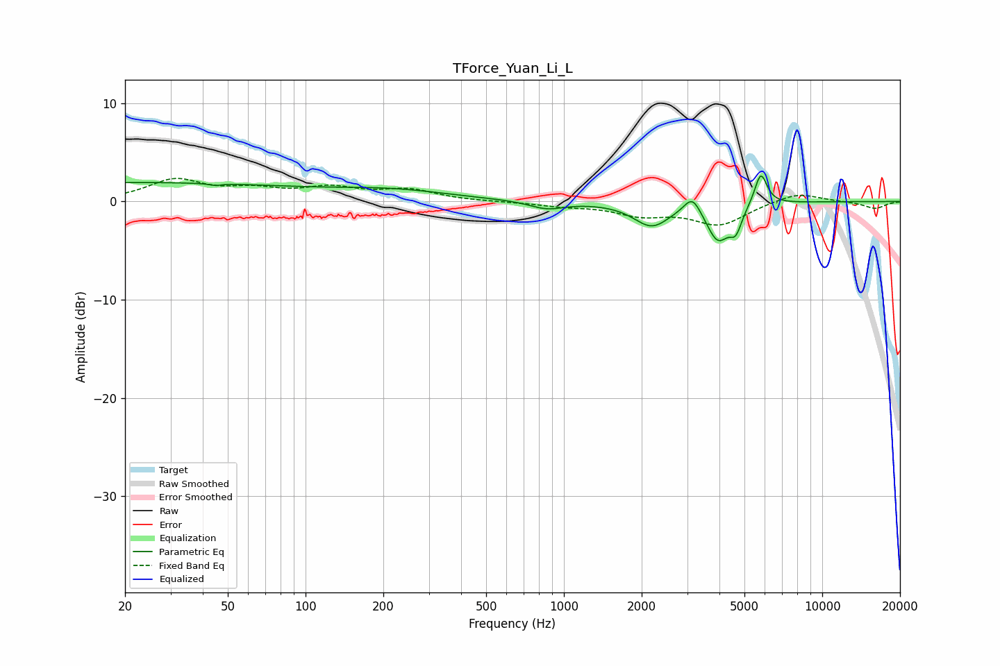

# TForce_Yuan_Li_L
See [usage instructions](https://github.com/jaakkopasanen/AutoEq#usage) for more options and info.

### Parametric EQs
Apply preamp of -2.7 dB when using parametric equalizer.

|   # | Type    |   Fc (Hz) |    Q |   Gain (dB) |
|-----|---------|-----------|------|-------------|
|   1 | Peaking |        20 | 0.18 |         1.9 |
|   2 | Peaking |        46 | 5.91 |        -1.6 |
|   3 | Peaking |        46 | 5.93 |         1.4 |
|   4 | Peaking |       218 | 0.62 |         1   |
|   5 | Peaking |       859 | 2.09 |        -0.8 |
|   6 | Peaking |      2186 | 2.03 |        -2.4 |
|   7 | Peaking |      3143 | 4.37 |         1.8 |
|   8 | Peaking |      3946 | 3.18 |        -3.7 |
|   9 | Peaking |      4631 | 6    |        -2.1 |
|  10 | Peaking |      5782 | 5.76 |         3.3 |

### Fixed Band EQs
When using fixed band (also called graphic) equalizer, apply preamp of **-2.4 dB** (if available) and set gains manually with these parameters.

|   # | Type    |   Fc (Hz) |    Q |   Gain (dB) |
|-----|---------|-----------|------|-------------|
|   1 | Peaking |        31 | 1.41 |         2.1 |
|   2 | Peaking |        62 | 1.41 |         1   |
|   3 | Peaking |       125 | 1.41 |         1.2 |
|   4 | Peaking |       250 | 1.41 |         1.1 |
|   5 | Peaking |       500 | 1.41 |        -0   |
|   6 | Peaking |      1000 | 1.41 |        -0.4 |
|   7 | Peaking |      2000 | 1.41 |        -1.2 |
|   8 | Peaking |      4000 | 1.41 |        -2.3 |
|   9 | Peaking |      8000 | 1.41 |         1   |
|  10 | Peaking |     16000 | 1.41 |        -0.7 |

### Graphs

