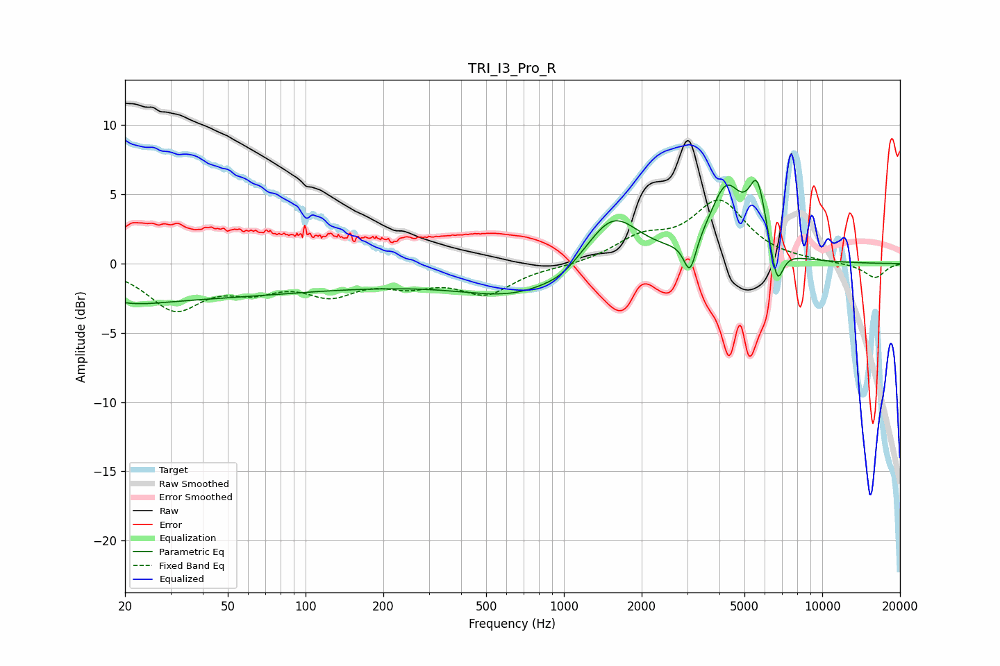

# TRI_I3_Pro_R
See [usage instructions](https://github.com/jaakkopasanen/AutoEq#usage) for more options and info.

### Parametric EQs
Apply preamp of -6.1 dB when using parametric equalizer.

|   # | Type    |   Fc (Hz) |    Q |   Gain (dB) |
|-----|---------|-----------|------|-------------|
|   1 | Peaking |        20 | 1.02 |        -0.9 |
|   2 | Peaking |        29 | 0.36 |        -1.9 |
|   3 | Peaking |       147 | 0.34 |        -1.2 |
|   4 | Peaking |       686 | 0.64 |        -2.1 |
|   5 | Peaking |       973 | 2.44 |        -0.3 |
|   6 | Peaking |      1542 | 1.35 |         3.9 |
|   7 | Peaking |      3075 | 6    |        -2.5 |
|   8 | Peaking |      4250 | 2.18 |         5   |
|   9 | Peaking |      5607 | 4.1  |         4.5 |
|  10 | Peaking |      6685 | 5.63 |        -2.9 |

### Fixed Band EQs
When using fixed band (also called graphic) equalizer, apply preamp of **-4.7 dB** (if available) and set gains manually with these parameters.

|   # | Type    |   Fc (Hz) |    Q |   Gain (dB) |
|-----|---------|-----------|------|-------------|
|   1 | Peaking |        31 | 1.41 |        -3.1 |
|   2 | Peaking |        62 | 1.41 |        -1.4 |
|   3 | Peaking |       125 | 1.41 |        -1.9 |
|   4 | Peaking |       250 | 1.41 |        -1.2 |
|   5 | Peaking |       500 | 1.41 |        -2   |
|   6 | Peaking |      1000 | 1.41 |        -0.2 |
|   7 | Peaking |      2000 | 1.41 |         1.6 |
|   8 | Peaking |      4000 | 1.41 |         4.3 |
|   9 | Peaking |      8000 | 1.41 |         0.1 |
|  10 | Peaking |     16000 | 1.41 |        -1   |

### Graphs

