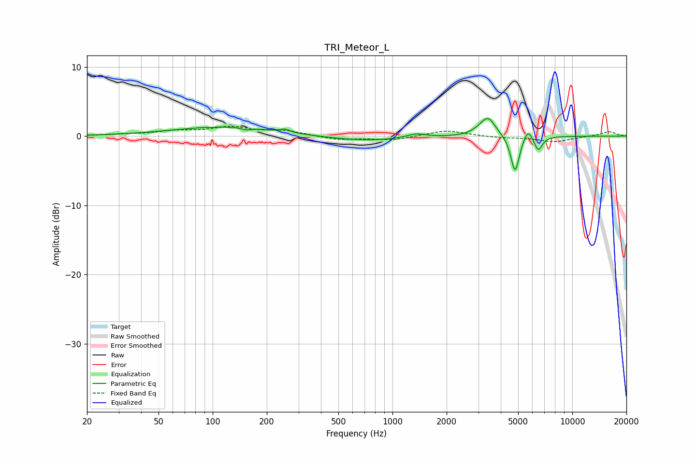

# TRI_Meteor_L
See [usage instructions](https://github.com/jaakkopasanen/AutoEq#usage) for more options and info.

### Parametric EQs
Apply preamp of -2.6 dB when using parametric equalizer.

|   # | Type    |   Fc (Hz) |    Q |   Gain (dB) |
|-----|---------|-----------|------|-------------|
|   1 | Peaking |       117 | 0.5  |         1.4 |
|   2 | Peaking |       155 | 5.86 |        -0.3 |
|   3 | Peaking |       253 | 6    |         0.4 |
|   4 | Peaking |       697 | 0.64 |        -0.7 |
|   5 | Peaking |      1359 | 2.67 |         0.6 |
|   6 | Peaking |      3096 | 3.13 |         0.5 |
|   7 | Peaking |      3416 | 3.45 |         2.5 |
|   8 | Peaking |      4806 | 6    |        -5.4 |
|   9 | Peaking |      5685 | 5.97 |         1.6 |
|  10 | Peaking |      6468 | 6    |        -2.1 |

### Fixed Band EQs
When using fixed band (also called graphic) equalizer, apply preamp of **-1.5 dB** (if available) and set gains manually with these parameters.

|   # | Type    |   Fc (Hz) |    Q |   Gain (dB) |
|-----|---------|-----------|------|-------------|
|   1 | Peaking |        31 | 1.41 |         0.2 |
|   2 | Peaking |        62 | 1.41 |         0.6 |
|   3 | Peaking |       125 | 1.41 |         1.2 |
|   4 | Peaking |       250 | 1.41 |         0.7 |
|   5 | Peaking |       500 | 1.41 |        -0.5 |
|   6 | Peaking |      1000 | 1.41 |        -0.6 |
|   7 | Peaking |      2000 | 1.41 |         0.9 |
|   8 | Peaking |      4000 | 1.41 |        -0.2 |
|   9 | Peaking |      8000 | 1.41 |        -0.8 |
|  10 | Peaking |     16000 | 1.41 |         0.7 |

### Graphs

