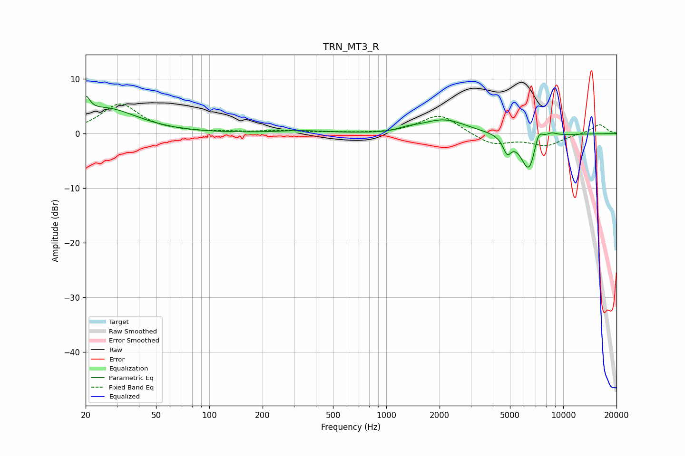

# TRN_MT3_R
See [usage instructions](https://github.com/jaakkopasanen/AutoEq#usage) for more options and info.

### Parametric EQs
Apply preamp of -6.9 dB when using parametric equalizer.

|   # | Type    |   Fc (Hz) |    Q |   Gain (dB) |
|-----|---------|-----------|------|-------------|
|   1 | Peaking |        20 | 6    |         3.1 |
|   2 | Peaking |        26 | 0.82 |         4.5 |
|   3 | Peaking |       326 | 1.04 |         0.5 |
|   4 | Peaking |      1042 | 1.31 |        -0.3 |
|   5 | Peaking |      1306 | 2.55 |         0.5 |
|   6 | Peaking |      2110 | 1.11 |         2.6 |
|   7 | Peaking |      4818 | 6    |        -2.8 |
|   8 | Peaking |      6419 | 2.92 |        -7.4 |
|   9 | Peaking |      7233 | 5.09 |         3.4 |
|  10 | Peaking |      8517 | 3.56 |         0.9 |

### Fixed Band EQs
When using fixed band (also called graphic) equalizer, apply preamp of **-5.5 dB** (if available) and set gains manually with these parameters.

|   # | Type    |   Fc (Hz) |    Q |   Gain (dB) |
|-----|---------|-----------|------|-------------|
|   1 | Peaking |        31 | 1.41 |         5.4 |
|   2 | Peaking |        62 | 1.41 |         0.2 |
|   3 | Peaking |       125 | 1.41 |         0.2 |
|   4 | Peaking |       250 | 1.41 |         0.5 |
|   5 | Peaking |       500 | 1.41 |         0.2 |
|   6 | Peaking |      1000 | 1.41 |        -0   |
|   7 | Peaking |      2000 | 1.41 |         3.6 |
|   8 | Peaking |      4000 | 1.41 |        -2.1 |
|   9 | Peaking |      8000 | 1.41 |        -2.1 |
|  10 | Peaking |     16000 | 1.41 |         1.7 |

### Graphs

