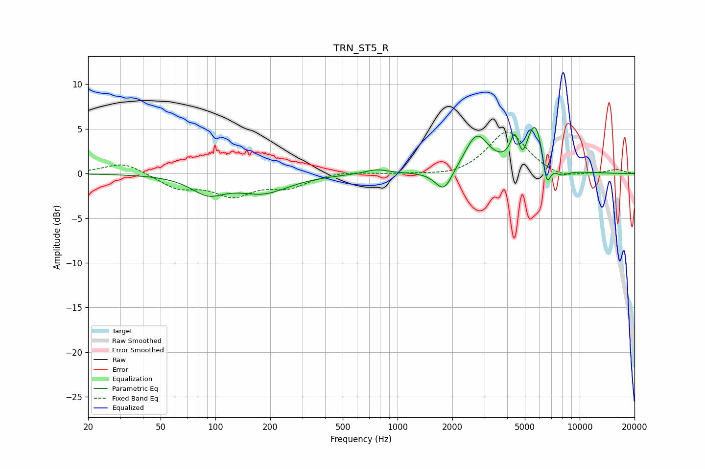

# TRN_ST5_R
See [usage instructions](https://github.com/jaakkopasanen/AutoEq#usage) for more options and info.

### Parametric EQs
Apply preamp of -5.3 dB when using parametric equalizer.

|   # | Type    |   Fc (Hz) |    Q |   Gain (dB) |
|-----|---------|-----------|------|-------------|
|   1 | Peaking |        91 | 1.54 |        -1.9 |
|   2 | Peaking |       183 | 1    |        -2   |
|   3 | Peaking |       767 | 2.21 |         0.5 |
|   4 | Peaking |      1796 | 3.02 |        -2.5 |
|   5 | Peaking |      2724 | 2.14 |         4.2 |
|   6 | Peaking |      4394 | 6    |         2.7 |
|   7 | Peaking |      4876 | 6    |        -1.6 |
|   8 | Peaking |      5710 | 2.69 |         5.8 |
|   9 | Peaking |      6586 | 6    |        -3.7 |
|  10 | Peaking |      7891 | 3.21 |        -0.9 |

### Fixed Band EQs
When using fixed band (also called graphic) equalizer, apply preamp of **-4.7 dB** (if available) and set gains manually with these parameters.

|   # | Type    |   Fc (Hz) |    Q |   Gain (dB) |
|-----|---------|-----------|------|-------------|
|   1 | Peaking |        31 | 1.41 |         1.3 |
|   2 | Peaking |        62 | 1.41 |        -1.5 |
|   3 | Peaking |       125 | 1.41 |        -2.2 |
|   4 | Peaking |       250 | 1.41 |        -1.4 |
|   5 | Peaking |       500 | 1.41 |         0.3 |
|   6 | Peaking |      1000 | 1.41 |        -0   |
|   7 | Peaking |      2000 | 1.41 |        -0.4 |
|   8 | Peaking |      4000 | 1.41 |         4.8 |
|   9 | Peaking |      8000 | 1.41 |        -0.7 |
|  10 | Peaking |     16000 | 1.41 |         0.5 |

### Graphs

