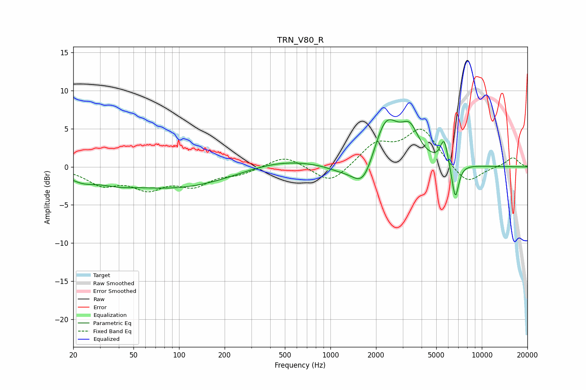

# TRN_V80_R
See [usage instructions](https://github.com/jaakkopasanen/AutoEq#usage) for more options and info.

### Parametric EQs
Apply preamp of -6.3 dB when using parametric equalizer.

|   # | Type    |   Fc (Hz) |    Q |   Gain (dB) |
|-----|---------|-----------|------|-------------|
|   1 | Peaking |        23 | 1.53 |        -1.1 |
|   2 | Peaking |        39 | 1.32 |        -0.6 |
|   3 | Peaking |        95 | 0.37 |        -2.8 |
|   4 | Peaking |       453 | 0.58 |         1.2 |
|   5 | Peaking |      1158 | 1.47 |        -0.7 |
|   6 | Peaking |      1655 | 1.9  |        -4.1 |
|   7 | Peaking |      2319 | 1.63 |         6.6 |
|   8 | Peaking |      3355 | 2.42 |         3.6 |
|   9 | Peaking |      5632 | 5.77 |         3.2 |
|  10 | Peaking |      6678 | 6    |        -4.7 |

### Fixed Band EQs
When using fixed band (also called graphic) equalizer, apply preamp of **-5.0 dB** (if available) and set gains manually with these parameters.

|   # | Type    |   Fc (Hz) |    Q |   Gain (dB) |
|-----|---------|-----------|------|-------------|
|   1 | Peaking |        31 | 1.41 |        -2.1 |
|   2 | Peaking |        62 | 1.41 |        -2.5 |
|   3 | Peaking |       125 | 1.41 |        -2.2 |
|   4 | Peaking |       250 | 1.41 |        -0.8 |
|   5 | Peaking |       500 | 1.41 |         1.6 |
|   6 | Peaking |      1000 | 1.41 |        -2.4 |
|   7 | Peaking |      2000 | 1.41 |         2.9 |
|   8 | Peaking |      4000 | 1.41 |         4.8 |
|   9 | Peaking |      8000 | 1.41 |        -2.5 |
|  10 | Peaking |     16000 | 1.41 |         1.3 |

### Graphs

