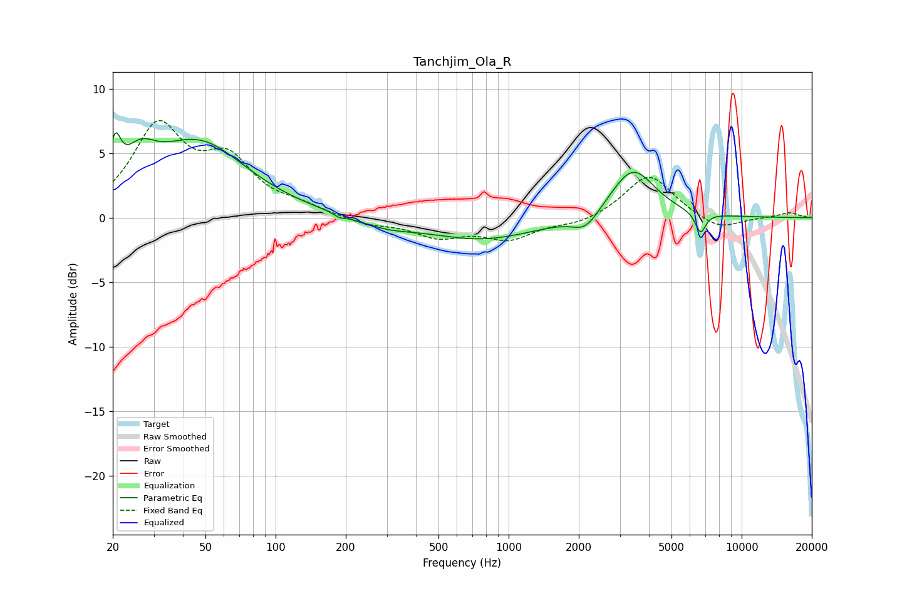

# Tanchjim_Ola_R
See [usage instructions](https://github.com/jaakkopasanen/AutoEq#usage) for more options and info.

### Parametric EQs
Apply preamp of -6.7 dB when using parametric equalizer.

|   # | Type    |   Fc (Hz) |    Q |   Gain (dB) |
|-----|---------|-----------|------|-------------|
|   1 | Peaking |        20 | 6    |         3.1 |
|   2 | Peaking |        26 | 2.11 |         2.4 |
|   3 | Peaking |        47 | 0.68 |         5.7 |
|   4 | Peaking |       188 | 5.98 |        -0.3 |
|   5 | Peaking |       297 | 1.23 |        -0.6 |
|   6 | Peaking |       773 | 0.6  |        -1.7 |
|   7 | Peaking |      2138 | 2.51 |        -1.3 |
|   8 | Peaking |      3410 | 1.49 |         3.9 |
|   9 | Peaking |      6666 | 6    |        -1.7 |
|  10 | Peaking |      7102 | 6    |         0   |

### Fixed Band EQs
When using fixed band (also called graphic) equalizer, apply preamp of **-7.6 dB** (if available) and set gains manually with these parameters.

|   # | Type    |   Fc (Hz) |    Q |   Gain (dB) |
|-----|---------|-----------|------|-------------|
|   1 | Peaking |        31 | 1.41 |         6.8 |
|   2 | Peaking |        62 | 1.41 |         3.9 |
|   3 | Peaking |       125 | 1.41 |         0.7 |
|   4 | Peaking |       250 | 1.41 |        -0.5 |
|   5 | Peaking |       500 | 1.41 |        -1.4 |
|   6 | Peaking |      1000 | 1.41 |        -1.5 |
|   7 | Peaking |      2000 | 1.41 |        -0.5 |
|   8 | Peaking |      4000 | 1.41 |         3.4 |
|   9 | Peaking |      8000 | 1.41 |        -1   |
|  10 | Peaking |     16000 | 1.41 |         0.4 |

### Graphs

